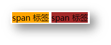

- [CSS 初体验](#css-初体验)
- [CSS 引入方式](#css-引入方式)
- [CSS 特性](#css-特性)
    - [继承性](#继承性)
    - [层叠性](#层叠性)
    - [优先级](#优先级)
        - [基础选择器](#基础选择器)
        - [复合选择器-叠加计算规则](#复合选择器-叠加计算规则)
- [显示模式](#显示模式)
    - [块级元素](#块级元素)
    - [行内元素](#行内元素)
    - [行内块元素](#行内块元素)
    - [转换显示模式](#转换显示模式)
- [基础选择器](#基础选择器-1)
    - [标签选择器](#标签选择器)
    - [类选择器](#类选择器)
    - [ID 选择器](#id-选择器)
    - [通配符选择器](#通配符选择器)
- [复合选择器](#复合选择器)
    - [后代选择器](#后代选择器)
    - [子代选择器](#子代选择器)
    - [并集选择器](#并集选择器)
    - [交集选择器](#交集选择器)
    - [伪类选择器](#伪类选择器)
        - [超链接的伪类](#超链接的伪类)
    - [结构伪类选择器](#结构伪类选择器)
    - [伪元素选择器](#伪元素选择器)
- [长宽背景色属性](#长宽背景色属性)
- [修饰属性](#修饰属性)
    - [垂直对齐方式](#垂直对齐方式)
    - [过渡效果](#过渡效果)
    - [透明度](#透明度)
    - [光标类型](#光标类型)
- [文字属性](#文字属性)
    - [字体大小](#字体大小)
    - [字体粗细](#字体粗细)
    - [字体倾斜](#字体倾斜)
    - [行高](#行高)
        - [单行文字垂直居中](#单行文字垂直居中)
    - [字体](#字体)
    - [font 复合属性](#font-复合属性)
    - [文本缩进](#文本缩进)
    - [文本对齐方式](#文本对齐方式)
    - [文本修饰线](#文本修饰线)
    - [文字颜色](#文字颜色)
- [背景图属性](#背景图属性)
    - [背景图引入](#背景图引入)
    - [背景图平铺方式](#背景图平铺方式)
    - [背景图位置](#背景图位置)
    - [背景图缩放](#背景图缩放)
    - [背景图固定](#背景图固定)
    - [背景复合属性](#背景复合属性)
- [盒子模型](#盒子模型)
    - [组成](#组成)
    - [尺寸计算](#尺寸计算)
    - [边框线](#边框线)
        - [四个方向](#四个方向)
        - [单方向](#单方向)
    - [内边距](#内边距)
        - [多值写法](#多值写法)
    - [外边距](#外边距)
        - [版心居中](#版心居中)
    - [外边距问题](#外边距问题)
        - [合并现象](#合并现象)
        - [塌陷问题](#塌陷问题)
    - [元素溢出](#元素溢出)
    - [圆角](#圆角)
        - [多值写法](#多值写法-1)
        - [正圆形状](#正圆形状)
        - [胶囊形状](#胶囊形状)
    - [盒子阴影](#盒子阴影)
- [字体图标 iconfont](#字体图标-iconfont)
    - [下载字体](#下载字体)
    - [使用字体](#使用字体)
    - [上传矢量图](#上传矢量图)


# CSS 初体验

层叠样式表 Cascading Style Sheets，缩写为 CSS

是一种 **样式表** 语言

用来描述/美化 HTML 文档的内容


# CSS 引入方式

* 内部样式表
  * CSS 代码写在 HTML 文件的 `style` 标签里面
* 外部样式表
  * CSS 代码写在单独的 CSS 文件中
  * 在 HTML 使用 `link` 标签引入

```html
<link rel="stylesheet" href="./my.css">
```

* 行内样式：配合 JavaScript 使用
  * CSS 写在标签的 `style` 属性值里

```html
<!-- 在 .html 文件中 -->
<!-- style="css属性" -->

<div style="color: red; font-size:20px;"> </div>
```


# CSS 特性

* 继承性
* 层叠性
* 优先级

### 继承性

子级默认继承父级的[文字属性](#文字属性)

> 注意：
> 
> 继承的优先级很低

### 层叠性

**选择器类型相同**则遵循层叠性，否则按选择器[优先级](#优先级)判断

特点：

* 相同的属性会覆盖：**后面的 CSS 属性覆盖前面的 CSS 属性**
* 不同的属性会叠加：**不同的 CSS 属性都生效**

```html
<style>
    div {
        color: red;
        font-weight: 700;
    }

    div {
        color: green;
        font-size: 30px;
    }
</style>

<!-- 内容是绿色的，文字粗细为 700，文字大小为 30px -->
<div> 内容 </div>
```

### 优先级

##### 基础选择器

公式：

`通配符选择器 < 标签选择器 < 类选择器 < id选择器 < 行内样式 < !important`

选中标签的范围越大，优先级越低

```css
/* !important 强行把某个属性提高为最高优先级 */

div {
    color: rebeccapurple !important;
}
```

##### 复合选择器-叠加计算规则

公式：

`行内样式，id 选择器个数，类选择器个数，标签选择器个数`

规则：

* 从左向右依次比较选个数，同一级个数多的优先级高，如果个数相同，则向后比较
* `!important` 权重最高
* 继承权重最低


# 显示模式

### 块级元素

如：`div`

特点：

* 独占一行
* 宽度默认是父级的 100%
* 可以设置宽高属性

### 行内元素

如：`span`

特点：

* 一行可以存在多个
* 宽高尺寸由内容撑开
* 不能设置宽高属性



### 行内块元素

如：`img`

特点：

* 一行可以存在多个
* 宽高尺寸由内容撑开
* 可以设置宽高属性

### 转换显示模式

属性：`display`

| 属性值           | 效果   |
| :--------------- | ------ |
| `block`          | 块级   |
| `inline`(不常用) | 行内   |
| `inline-block`   | 行内块 |

```css
display: inline-block;
```


# 基础选择器

### 标签选择器

使用**标签名**作为选择器

例如：`p`, `h1`, `div`, `a`, `img`......

```html
<!-- 对 .html 文件中的所有 p 标签都有效 -->

<style>
    p {
        color: red;
    }
</style>
```

### 类选择器

```html
<style>
    /* 定义类选择器 */
    .red {
        color: red;
    }

    .green {
        color: green
    }
</style>

<!-- 使用类选择器 -->
<!-- 使用多个类选择器的格式 -->
<div class="red size"> </div>
```

### ID 选择器

场景：id 选择器一般配合 **JavaScript** 使用，很少用来设置 CSS 样式

```html
<style>
    /* 定义 id 选择器 */
    #red {
        color: red;
    }
</style>

<!-- 使用 id 选择器 -->
<div id="red"> </div>
```

### 通配符选择器

设置页面的**所有**标签

**不需要调用**

```html
<style>
    * {
        margin: 0;
        padding: 0;
    }
</style>
```

> 通配符选择器可以用于**清除标签的默认样式**，例如：标签默认的外边距、内边距


# 复合选择器

由多个基础选择器，通过不同的方式组合而成

### 后代选择器

选择器写法：`父选择器 后代选择器 { CSS 属性 }`（之间用**空格**隔开）

```html
<style>
    /* div 中的所有 span 都变 */
    div span {
        color: red;
    }
</style>

<!-- 不变 -->
<span>span 标签</span>

<div>

    <!-- 变 -->
    <span>这是 div 的儿子 span</span>

    <p>
        <!-- 变 -->
        <span>这是 div 里面的 p 里面的 span</span>
    </p>

</div>
```

### 子代选择器

选择器写法：`父选择器 > 子选择器 { CSS 属性 }`

```html
<style>
    div>span {
        color: red;
    }
</style>

<div>

    <!-- 变 -->
    <span>这是 div 里面的 span</span>

    <p>
        <!-- 不变 -->
        <span>这是 div 里面的 p 里面的 span</span>
    </p>
    
</div>
```

### 并集选择器

选择器写法：`选择器1 , 选择器2 , … , 选择器N { CSS 属性 }`

```html
<style>
    div,
    p,
    span {
        color: red;
    }
</style>

<!-- 都变 -->
<p> </p>
<div> </div>
<span> </span>
```

### 交集选择器 

选中**同时满足多个条件**的元素

选择器写法：`选择器1选择器2 { CSS 属性 }` (选择器之间连写，没有任何符号) 

```html
<style>
    /* p 一定放在 .box 前面 */
    p.box {
        color: red;
    }
</style>

<!-- 不变 -->
<p> </p>

<!-- 变 -->
<p class="box"> </p>

<!-- 不变 -->
<div class="box"> </div>
```

> 注意：
> 
> 如果交集选择器中有标签选择器，标签选择器必须书写在最前面。 

### 伪类选择器 

**伪类**：元素的**状态**

鼠标悬停状态：`选择器:hover { CSS 属性 }`

```html
<style>
    a:hover {
        color: red;
    }

    .box:hover {
        color: green;
    }
</style>

<!-- 鼠标悬停在上面时，下面两句都有变化 -->
<a href="#"> </a>
<div class="box"> </div>
```

##### 超链接的伪类

| 选择器     | 作用     |
| :--------- | -------- |
| `:link`    | 访问前   |
| `:visited` | 访问后   |
| `:hover`   | 鼠标悬停 |
| `:active`  | 点击时   |

```css
a:link {
    color: red;
}

a:visited {
    color: green;
}
```

> 提示：按 L V H A 的顺序书写

### 结构伪类选择器 

作用：根据元素的**结构关系**查找元素

* `first-child` 第一个元素
* `last-child` 最后一个元素
* `nth-child` 第 N 个元素

```css
/* 选定 li 中的第一个元素 */

li:first-child {
    background-color: green;
}
```

`nth-child` 查找多个元素

```css
li:nth-child(2n) {
    background-color: green;
}
```


> 提示：公式中的 n 取值从 **0** 开始匹配
> 例如：n + 5 就是选定 5，6，7......

### 伪元素选择器


```css
/* 相当于在 div 中创建了两个子标签 */

div::before {
  content: "before 伪元素";
}

div::after {
  content: "after 伪元素";
}
```

注意点：

* 必须**设置 content 属性**或者**引号留空**，不然伪元素选择器语句失效
* 伪元素默认是行内元素的显示模式
* **权重和标签选择器相同**

# 长宽背景色属性

```html
<style>
    .someFuckingTest {
        width: 100px;
        height: 100px;
        background-color: brown;
    }
</style>

<div class="someFuckingTest">div</div>
```


# 修饰属性

### 垂直对齐方式 

属性名：`vertical-align`


基线


### 过渡效果

作用：可以为一个元素在不同状态之间切换的时候添加**过渡效果**

属性名：`transition`（复合属性）

属性值：`过渡的属性  花费时间 (s)`

提示：

* 过渡的属性可以是具体的 CSS 属性
* 也可以为 all（两个状态属性值不同的所有属性，都产生过渡效果）
* `transition` 设置给元素本身

```css
img {
    width: 200px;
    height: 200px;
    transition: all 1s;
}

img:hover {
    width: 500px;
    height: 500px;
}
```

### 透明度

作用：设置整个元素的透明度（包含背景和内容）

属性名：`opacity`

属性值：`0 ~ 1`

* 0：完全透明（元素不可见）
* 1：完全不透明

### 光标类型

作用：鼠标悬停在元素上时指针显示样式

属性名：`cursor`


# 文字属性

### 字体大小

* 属性名：`font-size`
* 属性值：网页最常用的单位 `px`

```css
p {
    font-size: 30px;
}
```

> 谷歌浏览器默认字号是 16px

### 字体粗细

* 属性名：`font-weight`
* 属性值：
  * 数字
    * 正常：400
    * 加粗：700
  * 关键字
    * `nomal`
    * `bold`

### 字体倾斜

* 属性名：`font-style`
* 属性值
  * 正常：`normal` 
  * 倾斜：`italic`

### 行高

作用：设置多行文本的间距

* 属性名：`line-height`
* 属性值
  * 数字 + px
  * 数字（当前标签 `font-size` 属性值的倍数）

```css
/* 当前标签字体大小为 16px */
/* 下面两句话等价 */

line-height: 32px;
line-height: 2;
```


##### 单行文字垂直居中

垂直居中技巧：**行高属性值**等于**盒子高度属性值**

注意：该技巧适用于**单行文字**垂直居中效果

```css
div {
    background-color: skyblue;

    height: 100px;
    line-height: 100px;
}
```

### 字体

* 属性名：`font-family`
* 属性值：字体名

```css
font-family: Microsoft YaHei, Heiti SC, tahoma, arial，sans-serif;
```

> 拓展：
> 
> 多个属性值用逗号隔开
> 
> 执行顺序：
> * 从左向右依次查找，使用找到的第一个字体
> * 如果都没找到则使用默认
> * 所以一般都在最后设置一个字体族名，网页开发建议使用**无衬线字体**（sans-serif）


### font 复合属性

```css
/* 格式 */
/* font：是否倾斜  是否加粗  字号/行高 字体（必须按顺序书写） */
/* 注意：字号和字体必须书写，否则语句不生效 */

font: italic 700 30px/2 Microsoft YaHei, Heiti SC, arial，sans-serif;
```


### 文本缩进 

* 属性名：`text-indent`
* 属性值
  * 数字 + px
  * **数字 + em**（推荐：1em = 当前标签的**字号大小**）

```css
/* 一般首行缩进 2 个字的大小 */

text-indent: 2em;
```

### 文本对齐方式 

作用：控制内容**水平对齐**方式

* 属性名：`text-align`
* 属性值：
  * 左对齐：`left` (默认)
  * 右对齐：`right`
  * 居中：`center`

```css
text-align: center;
```

```html
<!-- 标签的位置不变，只是标签中内容居中了 -->
<!-- 标签 <div> 并没有居中，是 <div> 中的 标题文字 居中了 -->

<style>
    div {
        text-align: center;
    }
</style>

<div>
    标题文字
</div>
```


### 文本修饰线 

* 属性名：`text-decoration`
* 属性值
  * 无：`none`
  * 下划线：`underline`
  * 上划线：`overline`
  * 删除线：`line-through`


### 文字颜色
* 属性名：`color`
* 属性值：颜色表示方式
  * 

```css
color: rgb(255, 0, 0);
color: #00ffcc;
```

> 提示：只要属性值为颜色，都可以使用上述四种颜色表示方式，例如：背景色


# 背景图属性

### 背景图引入

* 属性名：`background-image`（VScode填充：`bgi`）
* 属性值：`url(图片路径)`

```css
div {
    width: 400px;
    height: 400px;

    background-image: url(./images/1.png);
}
```

> 提示：背景图默认是**平铺**（见下文）

### 背景图平铺方式

属性名：`background-repeat`（VScode填充：`bgr`） 

| 属性值      | 效果         |
| :---------- | ------------ |
| `no-repeat` | 不平铺       |
| `repeat`    | 平铺（默认） |
| `repeat-x`  | 水平方向平铺 |
| `repeat-y`  | 垂直方向平铺 |

```css
div {
    width: 400px;
    height: 400px;
    background-color: pink;
    background-image: url(./images/1.png);

    background-repeat: no-repeat;
}
```

### 背景图位置

属性名：`background-position`

属性值：`水平方向位置 垂直方向位置`

1. 关键字
   * 

2. 坐标：数字 + px
   * 水平：正数向右；负数向左
   * 垂直：正数向下；负数向上

```css
div {
    width: 400px;
    height: 400px;
    background-color: pink;
    background-image: url(./images/1.png);
    background-repeat: no-repeat;

    /* 第一个参数水平方向，第二个参数垂直反向 */
    background-position: -50px bottom;

    /* 关键字取值方式写法，可以颠倒取值顺序 */
    background-position: bottom left;

    /* 可以只写一个关键字，另一个方向默认为居中 */
    background-position: bottom;

    /* 数字只写一个值表示水平方向，垂直方向为居中 */
    background-position: 50px;
}
```

### 背景图缩放

作用：设置背景图大小

属性名：`background-size`（bgz）

常用属性值：

* 关键字
  * `cover`：等比例缩放，背景图片**完全覆盖**背景区，可能背景图片部分看不见
  * `contain`：等比例缩放，背景图片**完全装入**背景区，可能背景区部分空白

* 百分比：根据盒子尺寸计算图片大小
* 数字 + 单位（例如：px）

```css
div {
    width: 500px;
    height: 400px;
    background-color: pink;
    background-image: url(./images/1.png);
    background-repeat: no-repeat;

    background-size: cover;
    background-size: contain;
}
```


### 背景图固定

作用：背景不会随着元素的内容滚动

属性名：`background-attachment`

属性值：`fixed`

```css
body {
    background-image: url(./images/bg.jpg);
    background-repeat: no-repeat;

    background-attachment: fixed;
}
```

### 背景复合属性

属性名：`background`（bg）

属性值：`背景色 背景图 背景图平铺方式 背景图位置/背景图缩放 背景图固定`

空格隔开各个属性值，不区分顺序

```css
div {
    width: 400px;
    height: 400px;

    background: pink url(./images/1.png) no-repeat right center/cover;
}
```


# 盒子模型

### 组成

* 内容区域 – `width & height`
* 内边距 – `padding`
* 边框线 – `border` 
* 外边距 – `margin`（盒子外面）

```css
div {
    margin: 50px;
    border: 5px solid brown;
    padding: 20px;

    width: 200px;
    height: 200px;

    background-color: pink;
}
```


### 尺寸计算

默认情况：

盒子尺寸 = 内容尺寸 + padding 尺寸 + border 尺寸 

即给盒子加 border / padding 会撑大盒子

```css
/* 此时盒子一共为 140px*140px */
width: 100px;
height: 100px;
padding: 20px;
```

解决方式：

* 手动做减法，减掉 border / padding 的尺寸
* 內减模式：`box-sizing: border-box`

```html
<style>
    .someFuckingTest {
        background-color: skyblue;
        width: 100px;
        height: 100px;

        padding: 20px;
        border: 10px solid red;
        
        /* 内减语句 */
        box-sizing: border-box;

        line-height: 100px;
    }
</style>

<div class="someFuckingTest">div</div>
```

* 内减语句的效果截图（ div 的位置很奇怪，`line-height: 100px;` 改为 `40px` 即可 ）
  * 

* 没有内减语句的效果截图
  * 

### 边框线

##### 四个方向

属性名：`border`

属性值：`边框线粗细  线条样式  颜色`（不区分顺序）

线条样式
* 实线：`solid`
* 虚线：`dashed`
* 点线：`dotted`

```css
div {
    /* 粗细 样式 颜色 */
    border: 5px solid brown;
}
```

##### 单方向

属性名：`border-方位名词`

属性值：`边框线粗细  线条样式  颜色`

```css
div {
    /* top right bottom left */
    border-top: 2px solid red;
    border-right: 3px dashed green;
    border-bottom: 4px dotted blue;
    border-left: 5px solid orange;
}
```

### 内边距

属性名：`padding` 或者 `padding-方位名词`

```css
div {
    /* 四个方向内边距都是 30px */
    padding: 30px;

    /* 单独设置一个方向内边距 */
    padding-top: 10px;
    padding-right: 20px;
    padding-bottom: 40px;
    padding-left: 80px;
}
```

##### 多值写法


> 技巧：从上开始顺时针赋值，当前方向没有数值则与对面取值相同

### 外边距 

属性名：`margin`

提示：与 `padding` 用法一样

##### 版心居中

左右 `margin` 值为 `auto`

```css
div {
  margin: 0 auto;

  width: 1000px;
  height: 200px;
  background-color: pink;
}
```

### 外边距问题

##### 合并现象

场景：**垂直**排列的兄弟元素，上下 `margin` 会**合并**

现象：取两个 `margin` 中的**较大值生效**

```css
/* 他们之间的距离为 50px */

.one {
    margin-bottom: 50px;
}

.two {
    margin-top: 20px;
}
```


##### 塌陷问题

场景：父子级的标签，子级添加 `margin-top` 会产生**塌陷**问题

现象：**导致父级一起向下移动**

```css
.son {
    margin-top: 50px;

    width: 100px;
    height: 100px;
    background-color: orange;
}
```


解决方法：

* 取消子级 `margin`，父级设置 `padding`
* 父级设置 `overflow: hidden`
* 父级设置 `border-top`

### 元素溢出

作用：控制溢出元素的显示方式

属性名：`overflow`


### 圆角

作用：设置元素的外边框为圆角

属性名：`border-radius`

属性值：`数字 + px/百分比`

提示：属性值代表**圆角半径**


##### 多值写法


> 技巧：从左上角开始顺时针赋值，当前角没有数值则与对角取值相同

##### 正圆形状

给**正方形**盒子设置圆角属性值为 `宽高的一半 / 50%`

```css
img {
    width: 200px;
    height: 200px;

    border-radius: 100px;

    /* 或者 */
    border-radius: 50%;
}
```


##### 胶囊形状

给**长方形**盒子设置圆角属性值为 `盒子高度的一半`

```css
div {
    background-color: orange;
    width: 200px;
    height: 80px;

    border-radius: 40px;
}
```


### 盒子阴影

属性名：`box-shadow`

属性值：`X轴偏移量  Y轴偏移量  模糊半径  扩散半径  颜色  内外阴影`

注意： 

* `X 轴偏移量` 和 `Y 轴偏移量` **必须书写**
* 默认是外阴影，内阴影是 `inset`

```css
box-shadow: 2px 5px 10px 0 rgba(0, 0, 0, 0.5) inset;
```


# 字体图标 iconfont


字体图标：**展示的是图标，本质是字体**

作用：在网页中添加**简单的、颜色单一**的小图标

优点

* **灵活性**：灵活地修改样式，例如：尺寸、颜色等
* **轻量级**：体积小、渲染快、降低服务器请求次数
* **兼容性**：几乎兼容所有主流浏览器
* **使用方便**：先下载再使用

### 下载字体

iconfont 图标库：<https://www.iconfont.cn/> 

登录 → 素材库 → 官方图标库


### 使用字体

1. 引入字体样式表（iconfont.css） 


2. 标签使用字体图标类名
   * iconfont：字体图标基本样式（字体名，字体大小等等）
   * icon-xxx：图标对应的类名


### 上传矢量图

图标 `SVG` 文件上传到 iconfont 图标库，网站帮你生成 `css` 字体文件


上传步骤：上传 → 上传图标 → 选择 svg 矢量图 → 提交 → 系统审核
