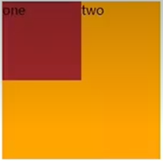
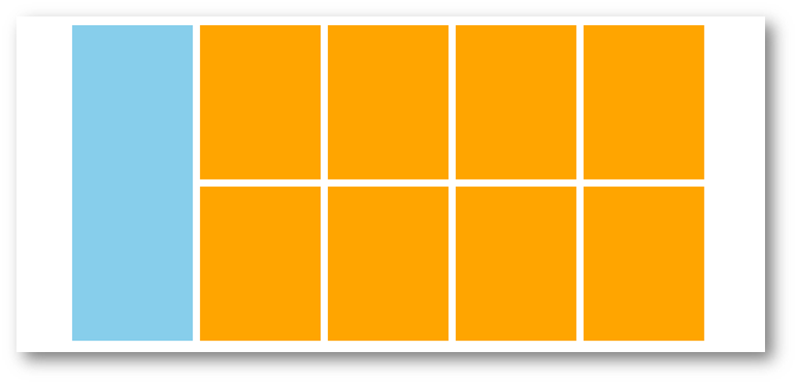
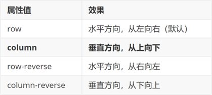
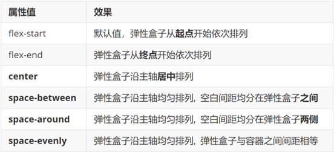
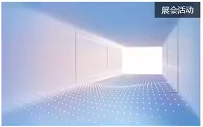

- [标准流](#标准流)
- [浮动](#浮动)
    - [基本使用](#基本使用)
    - [产品区域布局](#产品区域布局)
        - [HTML标签](#html标签)
        - [CSS样式](#css样式)
    - [清除浮动](#清除浮动)
        - [场景搭建](#场景搭建)
        - [额外标签法](#额外标签法)
        - [单伪元素法](#单伪元素法)
        - [双伪元素法](#双伪元素法)
        - [overfow 法](#overfow-法)
- [Flex布局](#flex布局)
    - [Flex 组成](#flex-组成)
    - [主轴对齐方式](#主轴对齐方式)
    - [侧轴对齐方式](#侧轴对齐方式)
    - [修改主轴方向](#修改主轴方向)
    - [弹性伸缩比](#弹性伸缩比)
    - [弹性盒子换行](#弹性盒子换行)
    - [行间对齐方式](#行间对齐方式)
- [定位](#定位)
    - [相对定位](#相对定位)
    - [绝对定位](#绝对定位)
    - [定位居中](#定位居中)
    - [固定定位](#固定定位)
    - [堆叠顺序](#堆叠顺序)


# 标准流

**标准流**指的是标签在页面中**默认的排布规则**，例如：块元素独占一行，行内元素可以一行显示多个

# 浮动

让块元素水平排列

### 基本使用

属性名：`float`

属性值

* `left`：左对齐
* `right`：右对齐

浮动后的盒子**脱标**，**不占用标准流的位置**

```html
<style>
    /* 特点：顶对齐；具备行内块显示模式特点 */

    .one {
        width: 100px;
        height: 100px;
        background-color: brown;

        float: left;
    }

    .two {
        width: 200px;
        height: 200px;
        background-color: orange;
    }
</style>

<div class="one">one</div>
<div class="two">two</div>
```



### 产品区域布局



##### HTML标签

```html
<!-- 版心：左右 -->
<!-- 右面：8个产品 --- 8个 li -->

<div class="product">

    <div class="left"></div>

    <div class="right">
        <ul>
            <li></li>
            <li></li>
            <li></li>
            <li></li>
            <li></li>
            <li></li>
            <li></li>
            <li></li>
        </ul>
    </div>

</div>
```

##### CSS样式

```html
<style>
    * {
        margin: 0;
        padding: 0;
    }

    li {
        list-style: none;
    }

    .product {
        margin: 50px auto;
        width: 1226px;
        height: 628px;
        background-color: pink;
    }

    .left {
        float: left;
        width: 234px;
        height: 628px;
        background-color: skyblue;
    }

    .right {
        float: right;
        width: 978px;
        height: 628px;
        background-color: brown;
    }

    .right li {
        float: left;

        margin-right: 14px;
        margin-bottom: 14px;

        width: 234px;
        height: 300px;
        background-color: orange;
    }

    /* 第四个li和第八个li 去掉右侧的margin */
    .right li:nth-child(4n) {
        margin-right: 0;
    }

    /* 细节：如果父级宽度不够，浮动的盒子会掉下来 */
    /* 我们以此所以实现了 8 个 li 的两排分布 */
</style>
```

### 清除浮动

场景：子级浮动，如果父级高度和子级**高度**不匹配，可能导致页面布局错乱

解决方法：清除浮动带来的影响

##### 场景搭建


```html
<style>
    .father {
        margin: 10px auto;
        width: 1200px;
        /* height: 300px; */
        background-color: pink;
    }

    .left {
        float: left;
        width: 200px;
        height: 300px;
        background-color: skyblue;
    }

    .right {
        float: right;
        width: 950px;
        height: 300px;
        background-color: orange;
    }

    .bottom {
        height: 100px;
        background-color: brown;
    }
</style>

<div class="father">
    <div class="left"></div>
    <div class="right"></div>
</div>
<div class="bottom"></div>
```

##### 额外标签法

在父元素内容的最后添加一个**块级**元素，设置 CSS 属性 `clear: both` 

```html
<style>
    .clearfix {
        clear: both;
    }
</style>

<div class="father">
    <div class="left"></div>
    <div class="right"></div>
    <div class="clearfix"></div>
</div>
```

##### 单伪元素法

1. 准备 `after` 伪元素

```css
/* 单伪元素法 */

.clearfix::after {
    content: "";
    /* 需要块级 */
    display: block;
    clear: both;
}
```

2. 父级使用 `clearfix`

```html
<div class="father clearfix"></div>
```

##### 双伪元素法

1. 准备 `after` 和 `before` 伪元素

```css
/* 双伪元素法 */

/* before 解决外边距塌陷问题 */
.clearfix::before,
.clearfix::after {
    content: "";
    display: table;
}

/* after 清除浮动 */
.clearfix::after {
    clear: both;
}
```

2. 父级使用 `clearfix`

```html
<div class="father clearfix"></div>
```

##### overfow 法

给父级加 `overflow: hidden;`

```css
.father {
    margin: 10px auto;
    width: 1200px;
    /* height: 300px; */
    background-color: pink;

    overflow: hidden;
}
```

# Flex布局

Flex 布局也叫**弹性布局**，是浏览器**提倡的布局模型**，非常适合**结构化**布局，提供了强大的空间分布和对齐能力。

### Flex 组成

设置方式：给父元素设置 `display: flex`，子元素可以自动挤压或拉伸

组成部分：

* 弹性容器
* 弹性盒子
* 主轴：默认在**水平**方向
* 侧轴：默认在**垂直**方向


### 主轴对齐方式

属性名：`justify-content`


```css
/* 父级剩余的尺寸分配为间距 */

justify-content: space-between
```

### 侧轴对齐方式

属性名：

* `align-items`：当前弹性容器内**所有**弹性盒子的侧轴对齐方式（给**弹性容器**设置）
* `align-self`：单独控制**某个弹性盒子**的侧轴对齐方式（给**弹性盒子**设置）


### 修改主轴方向

主轴默认在水平方向，侧轴默认在垂直方向

属性名：`flex-direction`



### 弹性伸缩比

作用：控制**弹性盒子**的**主轴方向**的尺寸

属性名：`flex`

属性值：整数数字，表示占用**父级剩余尺寸的份数**

```css
/* div:nth-child(1) 占 box 剩余位置的 1/3 */
/* div:nth-child(2) 占 box 剩余位置的 2/3 */

.box div:nth-child(1) {
    flex: 1;
}

.box div:nth-child(1) {
    flex: 2;
}
```

### 弹性盒子换行

默认情况下，弹性盒子会被自动挤压或拉伸导致所有弹性盒子都在一行显示

属性名：`flex-wrap`

属性值

* `wrap`：换行
* `nowrap`：不换行（默认）

### 行间对齐方式

属性名：`align-content`



> 注意：该属性对**单行**弹性盒子**无效** 


# 定位

作用：灵活的改变盒子在网页中的位置

实现：

1. 定位模式：`position`
2. 边偏移：设置盒子的位置

* `left`
* `right`
* `top`
* `bottom`

### 相对定位

`position: relative`

特点：

* 不脱标，占用自己原来位置
* 显示模式保持不变
* 边偏移参照物：自己原来位置

```css
div {
    position: relative;
    top: 100px;
    left: 200px;
}	
```

### 绝对定位

`position: absolute`

使用场景：子级绝对定位，父级相对定位

特点：

* 脱标，不占位
* 显示模式：行内块
* 边偏移参照物：最近的 `posision: relative` 祖先元素，否则浏览器可视区

```css
.father {
    position: relative;
}

.father span {
    position: absolute;
    top: 0;
    right: 0;
}
```



### 定位居中

```css
/* 方法一 */
position: absolute;
left: 50%;
top: 50%;

margin-left: -265px;
margin-top: -127px;


/* 方法二 */
position: absolute;
left: 50%;
top: 50%;

/* 50% 代表自己宽高的一半 */
transform: translate(-50%, -50%);
```

### 固定定位

`position: fixed`

场景：元素的位置不受滚动影响

特点：

* 脱标，不占位
* 显示模式：行内块
* 边偏移参照物：浏览器窗口

```css
div {
    position: fixed;
    top: 0;
    right: 0;

    width: 500px;
}
```

### 堆叠顺序

默认效果：按照标签书写顺序，后来者居上

属性名：`z-index`

属性值：整数数字（ 默认值为 0，取值越大，层级越高 ）

```css
.box1 {
    background-color: red;
    z-index: 1;
}

.box2 {
    background-color: yellow;
    left: 100px;
    top: 100px;
    z-index: 2;
}
```


