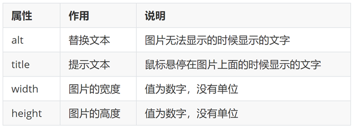
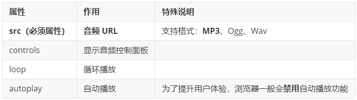

- [标签](#标签)
    - [标签的关系](#标签的关系)
- [HTML 骨架](#html-骨架)
- [注释](#注释)
- [布局标签](#布局标签)
    - [无语义的布局标签](#无语义的布局标签)
    - [有语义的布局标签](#有语义的布局标签)
- [标题标签](#标题标签)
- [段落标签](#段落标签)
- [文本效果标签](#文本效果标签)
- [换行和水平线标签](#换行和水平线标签)
- [字符实体](#字符实体)
- [图像标签](#图像标签)
- [超链接标签](#超链接标签)
- [音频](#音频)
- [视频](#视频)
- [列表 list](#列表-list)
    - [无序列表](#无序列表)
    - [有序列表](#有序列表)
    - [定义列表](#定义列表)
- [表格 table](#表格-table)
    - [基本使用](#基本使用)
    - [表格结构标签](#表格结构标签)
    - [合并单元格](#合并单元格)
- [表单](#表单)
    - [input 标签](#input-标签)
        - [占位文本](#占位文本)
        - [单选框](#单选框)
        - [多选框](#多选框)
        - [上传文件](#上传文件)
    - [下拉菜单 select](#下拉菜单-select)
    - [文本域 textarea](#文本域-textarea)
    - [按钮 button](#按钮-button)
    - [label 标签](#label-标签)


# 标签

* 标签要成对出现，中间包裹内容
* <>里面放**标签名**
* 结束标签比开始标签多 /
* 标签分类：双标签和单标签(大部分是双)

```html
<strong>需要加粗的文字<strong>

<!-- 单标签 -->
<br>    \\ 换行
<hr>    \\ 水平线
```

### 标签的关系

> 作用：明确标签的书写位置，让代码格式更整齐

* 父子关系（嵌套关系）：子级标签换行且缩进（Tab键）
  * 

* 兄弟关系（并列关系）：兄弟标签换行要对齐
  * 

# HTML 骨架

* html：整个网页
* head：网页头部，用来存放给浏览器看的信息，例如 CSS
  * title：网页标题
* body：网页主体，用来存放给用户看的信息，例如图片、文字

```html
<html>

  <head>
    <title>网页标题</title>
  </head>

  <body>
    网页主体
  </body>

</html>
```

> 提示
>
> VS Code 可以快速生成骨架：在 HTML 文件（.html）中，! 的智能填充


# 注释

在 VS Code 中，**添加 / 删除**注释的快捷键：**Ctrl + /** 

```html
<!-- 内容 -->
```


# 布局标签

### 无语义的布局标签 

作用：布局网页，划分网页区域

* div：独占一行
* span：不换行

```html
<!-- div：大盒子 -->
<div>这是 div 标签</div>
<div>这是 div 标签</div>

<!-- span：小盒子 -->
<span>这是 span 标签</span>
<span>这是 span 标签</span>
```


### 有语义的布局标签

```html
<!-- header  表示网页的头部 -->
<!-- main    表示网页的主体部分(一个页面中只会有一个main) -->
<!-- footer  表示网页的底部 -->
<!-- nav     表示网页中的导航 -->
<!-- aside   和主体相关的其他内容（侧边栏） -->
<!-- article 表示一个独立的文章 -->
<!-- section 表示一个独立的区块，上边的标签都不能表示时使用section  -->

<header>头部内容</header>
```


# 标题标签

```html
<h1>一级标题</h1>
<h2>二级标题</h2>
<h3>三级标题</h3>
<h4>四级标题</h4>
<h5>五级标题</h5>
<h6>六级标题</h6>
```

显示特点：

* 文字加粗
* 独占一行

> 经验
>
> 1. h1 标签在一个网页中只能用一次，用来放新闻标题或网页的 logo
> 2. h2 ~ h6 没有使用次数的限制

# 段落标签

```html
<p>段落</p>
```

显示特点：

* 独占一行
* 段落之间存在间隙

# 文本效果标签


> 提示：
> 
> strong、em、ins、del 标签自带**强调含义**（语义）

在 HTML 中无论输入多少个空格，只会显示一个，可以使用空格占位符：`&nbsp`

# 换行和水平线标签

* 换行：br
* 水平线：hr

```html
<br>
<hr>
```


# 字符实体

| 实体名称 | 描述 | 显示效果 |
| :------- | :--- | :------- |
| `&nbsp;` | 空格 |          |
| `&lt;`   | 小于 | <        |
| `&gt;`   | 大于 | >        |


# 图像标签

作用：在网页中插入图片

```html

```

*src* 用于指定图像的位置，是  的必须属性

图像属性




# 超链接标签

```html
<a href="https://www.baidu.com" target="">百度</a>

target：指定在何处打开资源链接
  _self ：默认值，在当前页面打开
  _blank：新窗口打开页面
```

```html
<!-- 开发初期，不知道超链接的跳转地址 -->

<!-- href属性值写 #，表示空链接，页面不会跳转，在当前页面刷新一次 -->

<a href="#">空链接</a>
```

# 音频

```html
<audio src="音频的 URL"></audio>
```

常用属性



```html
<!-- 在 HTML5 里面，如果属性名和属性值完全一样，可以简写为一个单词 -->

<audio src="./media/music.mp3" controls="controls"></audio>
<audio src="./media/music.mp3" controls loop autoplay></audio>
```

# 视频

```html
<video src="视频的 URL"></video>

width
height
...
```

常用属性


```html
<!-- 在浏览器中，想要自动播放，必须有 muted 属性 -->

<video src="./media/vue.mp4" controls loop muted autoplay></video>
```

# 列表 list

### 无序列表

标签：`ul` 嵌套 `li`，`ul` 是无序列表，`li` 是列表条目

```html
<ul>
  <li>第一项</li>
  <li>第二项</li>
  <li>第三项</li>
  ……
</ul>
```

### 有序列表

标签：`ol` 嵌套 `li`

```html
<ol>
  <li>第一项</li>
  <li>第二项</li>
  <li>第三项</li>
  ……
</ol>
```

> 注意事项：
>
> * ul ol 标签里面只能包裹 li 标签
> * li 标签里面可以包裹任何内容

### 定义列表

标签：`dl` 嵌套 `dt` 和 `dd`，`dl` 是定义列表，`dt` 是定义列表的标题，`dd` 是定义列表的描述 / 详情。

```html
<dl>
  <dt>列表标题</dt>
  <dd>列表描述 / 详情</dd>
   ……
</dl>
```


> 注意事项：
>
> * dl 里面只能包含dt 和 dd
> * dt 和 dd 里面可以包含任何内容


# 表格 table

网页中的表格与 Excel 表格类似，用来展示数据

### 基本使用

标签：`table` 嵌套 `tr`，`tr` 嵌套 `td` / `th`。 


> 提示：在网页中，**表格默认没有边框线**，使用 **border 属性**可以为表格添加边框线。 

```html
<table border="1">

  <tr>
    <th>姓名</th>
    <th>语文</th>
    <th>数学</th>
    <th>总分</th>
  </tr>

  <tr>
    <td>张三</td>
    <td>99</td>
    <td>100</td>
    <td>199</td>
  </tr>

  <tr>
    <td>李四</td>
    <td>98</td>
    <td>100</td>
    <td>198</td>
  </tr>

  <tr>
    <td>总结</td>
    <td>全市第一</td>
    <td>全市第一</td>
    <td>全市第一</td>
  </tr>

</table>
```


### 表格结构标签

作用：把内容划分区域，比如影响了[合并单元格](#合并单元格)


```html
<tbody>
    <tr>
        <td>张三</td>
        <td>99</td>
        <td>100</td>
        <td>199</td>
    </tr>
    <tr>
        <td>李四</td>
        <td>98</td>
        <td>100</td>
        <td>198</td>
    </tr>
</tbody>
```

> 提示：
> 
> 表格结构标签可以省略
> 省略就是没有


### 合并单元格


合并单元格的步骤：

1. 明确合并的目标
2. 保留**最左最上**的单元格，添加属性（取值是**数字**，表示需要**合并的单元格数量**）
   * **跨行合并**，保留最上单元格，添加属性 `rowspan`
   * **跨列合并**，保留最左单元格，添加属性 `colspan`
3. 删除其他单元格

```html
<tbody>
  <tr>
    <td>张三</td>
    <td>99</td>
    <td rowspan="2">100</td>
    <td>199</td>
  </tr>
  <tr>
    <td>李四</td>
    <td>98</td>
    <!-- <td>100</td> -->
    <td>198</td>
  </tr>
</tbody>

<tfoot>
  <tr>
    <td>总结</td>
    <td colspan="3">全市第一</td>
    <!-- <td>全市第一</td> -->
    <!-- <td>全市第一</td> -->
  </tr>
</tfoot>

```

> 注意：不能跨**表格结构标签**合并单元格（thead、tbody、tfoot）


# 表单

作用：常用来收集用户信息

例如：

* 登录页面
* 注册页面
* 搜索栏

### input 标签

input 标签 `type` 属性值不同，则功能不同

```html
<input type="..." >
```


##### 占位文本 

用来显示提示信息，文本框和密码框都可以使用

示例：

```html
<input type="text" placeholder="请输入用户名">
```


##### 单选框

常用属性


示例：

```html
<input type="radio" name="gender" checked> 男
<input type="radio" name="gender"> 女
```


##### 多选框

多选框也叫复选框，默认选中：`checked`

```html
<input type="checkbox" checked> 选项x
```

##### 上传文件

默认情况下，文件上传表单控件只能上传一个文件，添加 `multiple` 属性可以实现文件多选功能。

```html
<input type="file" multiple>
```

### 下拉菜单 select

标签：`select` 嵌套 `option`，`select` 是下拉菜单整体，`option` 是下拉菜单的每一项

```html
<select>
  <option>北京</option>
  <option>上海</option>
  <option>广州</option>
  <option>深圳</option>
  <option selected>武汉</option>
</select>
```


> 默认显示第一项，**selected** 属性实现**默认选中**功能

### 文本域 textarea

作用：多行输入文本


```html
<textarea>默认提示文字</textarea>
```

> 注意点：
>
> * 实际开发中，使用 CSS 设置**文本域的尺寸**
> * 实际开发中，一般禁用右下角的拖拽功能

### 按钮 button

```html
<button type="">提示</button>
```


```html
<!-- form   表单区域 -->
<!-- action 发送数据的地址 -->
<form action="">
  用户名：<input type="text">
  <br><br>
  密码：<input type="password">
  <br><br>

  <!-- 如果省略 type 属性，默认 submit -->
  <button type="submit">提交</button>
  <button type="reset">重置</button>
  <button type="button">普通按钮</button>
</form>
```

```
action：表单数据提交的 url 地址
method：表单提交方式
```


> 提示：按钮需配合 **form** 标签才能实现对应的功能

### label 标签 

作用：给表单标签添加说明文本

* 写法一
  - label 标签只包裹**文字内容**，不包裹**表单控件**
  - 设置 label 标签的 for 属性值 和表单控件的 id 属性值相同

```html
<!-- 无标签 -->
<input type="radio">男

<!-- 加入 label -->
<!-- 使用 label 标签绑定文字和表单控件的关系，增大表单控件的点击范围。 -->
<input type="radio" id="man">
<label for="man">男</label>
```

* 写法二
  - 使用 label 标签包裹**文字内容**和**表单控件** 

```html
<label><input type="radio"> 女</label>
```

> 提示：  
> 
> 支持 label 标签增大点击范围的表单控件：  
> 文本框、密码框、上传文件、单选框、多选框、下拉菜单、文本域等等。 

