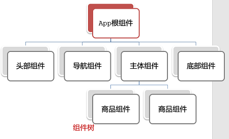

- [Vue CLI](#vue-cli)
  - [基本介绍](#基本介绍)
      - [好处](#好处)
      - [使用](#使用)
  - [项目目录介绍和运行流程](#项目目录介绍和运行流程)
      - [项目目录介绍](#项目目录介绍)
      - [入口文件](#入口文件)
      - [占用端口](#占用端口)
- [组件](#组件)
  - [组件分类](#组件分类)
  - [根组件 App.vue](#根组件-appvue)
  - [普通组件的注册使用](#普通组件的注册使用)
      - [局部注册](#局部注册)
      - [全局注册](#全局注册)
  - [组件是由三部分构成](#组件是由三部分构成)
      - [scoped 解决样式冲突](#scoped-解决样式冲突)
      - [data 是一个函数](#data-是一个函数)
- [组件通信](#组件通信)
  - [组件关系分类和通信解决方案](#组件关系分类和通信解决方案)
      - [父向子通信示例](#父向子通信示例)
      - [子向父通信代码示例](#子向父通信代码示例)
      - [非父子通信-bus](#非父子通信-bus)
      - [非父子通信-provide\&inject](#非父子通信-provideinject)
  - [props 校验](#props-校验)
- [插槽](#插槽)
- [路由的基本使用](#路由的基本使用)
  - [VueRouter 的使用](#vuerouter-的使用)
      - [固定 5 个固定的步骤](#固定-5-个固定的步骤)
      - [两个核心步骤](#两个核心步骤)
  - [路由的封装抽离](#路由的封装抽离)
  - [vue-router](#vue-router)
      - [router-link 自带的两个样式](#router-link-自带的两个样式)
  - [Vue 路由的重定向](#vue-路由的重定向)
  - [Vue 路由 404](#vue-路由-404)
  - [Vue 路由的模式设置](#vue-路由的模式设置)
- [路由跳转](#路由跳转)
  - [声明式导航](#声明式导航)
      - [查询参数传参](#查询参数传参)
      - [动态路由传参](#动态路由传参)
      - [区别](#区别)
  - [编程式导航](#编程式导航)
      - [path 路径跳转](#path-路径跳转)
      - [name 命名路由跳转](#name-命名路由跳转)
- [Element](#element)
- [Axios](#axios)
- [打包部署](#打包部署)

---

# Vue CLI

## 基本介绍

Vue CLI 是 Vue 官方提供的一个全局命令工具

可以帮助我们快速创建一个开发 Vue 项目的标准化基础架子【集成了webpack配置】

#### 好处

1. 开箱即用，零配置
2. 内置 babel 等工具
3. 标准化的 webpack 配置

#### 使用

需要 NodeJS

1. 全局安装 `npm install -g @vue/cli`
2. 创建项目架子：`vue create project-name` (项目名不能使用中文) 或者 `vue ui`
3. 启动项目：`npm run serve` ( 命令不固定，配置在 package.json )

## 项目目录介绍和运行流程

#### 项目目录介绍


虽然脚手架中的文件有很多，目前咱们只需认识三个文件即可

1. `main.js`  入口文件
2. `App.vue`  App根组件 
3. `index.html ` 模板文件

#### 入口文件


#### 占用端口

vue.config.js 文件中为 `module.exports` 添加

```
devServer:{port: xx}
```

# 组件

## 组件分类

.vue 文件分为 2 类

- 页面组件 （配置路由规则时使用的组件）：详见路由章节
- 复用组件（多个组件中都使用到的组件）

【存放目录】 分类开来的目的就是为了更易维护

- src/views 文件夹
- src/components 文件夹

## 根组件 App.vue

整个应用最上层的组件，包裹所有普通小组件



## 普通组件的注册使用

#### 局部注册

语法

```html
# 局部使用 whatever.vue
# 在 components 文件夹中创建 whatever.vue

<script>
// 1. 在需要使用 whatever.vue 组件的文件中导入 whatever.vue
import someFuckingVar from './components/whatever.vue'
  
// 2. 局部注册
export default {
  components: {
    someFuckingName:someFuckingVar
    // 或者只写一个 someFuckingVar，等价于 someFuckingVar:someFuckingVar
  }
}
</script>

// 使用方式
<template>
  <someFuckingName> </someFuckingName>
</template>
```

#### 全局注册

```js
# 1. 导入 main.js
import someFuckingVar from './components/whatever.vue'

# 2. 全局注册
Vue.component('someFuckingName',someFuckingVar)
```

## 组件是由三部分构成

- 三部分构成
  - `template` : 结构 （vue2 中有且只能一个根元素）
  - `script` : js 逻辑 
  - `style` : 样式 (可支持less，需要装包)


- 让组件支持less
  1. style 标签，`lang="less"` 开启 less 功能 
  2. 装包 : `npm i less less-loader -D`

#### scoped 解决样式冲突

默认情况：写在组件中的样式会【全局生效】

可以给组件加上 `scoped` 属性，让样式只作用于当前组件

`<style scoped>`


#### data 是一个函数

目的是为了：保证每个组件实例，维护独立的一份数据对象

```js
# BaseCount.vue

<script>
export default {
  data: function () {
    return {
      count: 100,
    }
  },
}
</script>
```


# 组件通信

组件通信，就是指组件与组件之间的数据传递

- 组件的数据是独立的，无法直接访问其他组件的数据
- 想使用其他组件的数据，就需要组件通信

## 组件关系分类和通信解决方案

1. 父子关系
   - `props`
   - `$emit`
2. 非父子关系
   - `provede & inject`
   - `eventbus`

#### 父向子通信示例

父组件通过 props 将数据传递给子组件


父向子传值步骤

1. 给子组件以添加属性的方式传值
2. 子组件内部通过 props 接收
3. 模板中直接使用 props 接收的值

#### 子向父通信代码示例

子组件利用 $emit 通知父组件，进行修改更新


子向父传值步骤

1. $emit触发事件，给父组件发送消息通知
2. 父组件监听$emit触发的事件
3. 提供处理函数，在函数的性参中获取传过来的参数

#### 非父子通信-bus

非父子组件之间进行简易消息传递 (复杂场景：Vuex)

【步骤】

1. 创建一个都能访问的事件总线（空 Vue 实例）

   ```js
   import Vue from 'vue'
   const Bus = new Vue()
   export default Bus
   ```

2. 接受方，监听 Bus 的 $on 事件

   ```js
   created () {
     Bus.$on('sendMsg', (msg) => {
       this.msg = msg
     })
   }
   ```

3. 发送方，触发 Bus 的 $emit 事件

   ```js
   Bus.$emit('sendMsg', '这是一个消息')
   ```

#### 非父子通信-provide&inject

跨层级共享数据

【场景】


【语法】

1. 父组件 `provide()` 提供数据

    ```js
    export default {
      provide () {
        return {
          // 普通类型【非响应式】
          color: this.color, 
          // 复杂类型【响应式】
          userInfo: this.userInfo, 
        }
      }
    }
    ```

2. 子/孙组件 inject() 获取数据

    ```js
    export default {
      inject: ['color','userInfo'],
      created () {
        console.log(this.color, this.userInfo)
      }
    }
    ```

【注意】

- provide提供的简单类型的数据不是响应式的，复杂类型数据是响应式。（推荐提供复杂类型数据）
- 子/孙组件通过 inject 获取的数据，不能在自身组件内修改

## props 校验

为组件的 prop 指定验证要求，不符合要求，控制台就会有错误提示

```html
<script>
export default {
  props: ['w'],
  //
  props: {
    w: Number
  }
  //
  props: {
    w: {
      type: ,                    // 类型校验
      required: ,               // 是否必填
      default: ,               // 默认
      validator (value) {    // value 为传来的值
        // 自定义校验逻辑
        return bool
      }
    }
  }
}
</script>
```


# 插槽

【作用】

让组件内部的一些  结构支持自定义

【基本语法】
1. slot 占位
2. 可以有默认内容
3. 为 slot 赋予唯一标识符 name
4. 可以传递参数，不过我没记相应的笔记

【代码】

```js
# MyDialog.vue

<template>
    <div>
        <slot name="test">默认内容</slot>
    </div>
</template>
```

```js
# App.vue

<template>
    <div>
        <MyDialog>
            <template v-slot:test> // v-slot: 可以简写为 #
                代替 slot
            </template>
        </MyDialog>
    </div>
</template>
```


# 路由的基本使用

[官网](https://v3.router.vuejs.org/zh/)

## VueRouter 的使用

#### 固定 5 个固定的步骤

1. 下载 VueRouter 模块到当前工程，版本3.6.5

   ```bash
   yarn add vue-router@3.6.5
   ```

2. main.js 中引入VueRouter

   ```js
   import VueRouter from 'vue-router'
   ```

3. 安装注册

   ```js
   Vue.use(VueRouter)
   ```

4. 创建路由对象

   ```js
   const router = new VueRouter()
   ```

5. 注入，将路由对象注入到 new Vue 实例中，建立关联

   ```js
   new Vue({
     render: h => h(App),
     router:router
   }).$mount('#app')

   ```

当我们配置完以上5步之后 就可以看到浏览器地址栏中的路由 变成了 `/#/` 的形式表示项目的路由已经被 Vue-Router 管理了


#### 两个核心步骤

1. 创建需要的组件 (views目录)，配置路由规则

    ```js
    # main.js

    const router = new VueRouter({
    // routes 路由规则们
    // route  一条路由规则 { path: 路径, component: 组件 }
    routes: [
      { path: '/find', component: Find },
      { path: '/my', component: My },
      { path: '/friend', component: Friend },
    ]
    })
    ```

2.  配置导航，配置路由出口(路径匹配的组件显示的位置)

    ```js
    # App.vue

    <div class="footer_wrap">
      <a href="#/find">发现音乐</a>
      <a href="#/my">我的音乐</a>
      <a href="#/friend">朋友</a>
    </div>

    <div class="top">
      <router-view></router-view>
    </div>
    ```

## 路由的封装抽离

问题：所有的路由配置都在 main.js 中合适吗？

目标：将路由模块抽离出来

好处：**拆分模块，利于维护**


路径简写：

脚手架环境下 `@` 指代 src 目录，可以用于快速引入组件

## vue-router

全局组件 `router-link` 取代 `a` 标签

它本质还是 a 标签

语法： `<router-link to="path">content</router-link>`

```html
<router-link to="/find">发现音乐</router-link>
<router-link to="/my">我的音乐</router-link>
```

#### router-link 自带的两个样式

使用 router-link 跳转后，我们发现，当前点击的链接默认加了两个 class 的值

- `router-link-exact-active`
  - 模糊匹配
- `router-link-active`
  - 精确匹配

我们可以给任意一个 class 属性添加高亮样式即可实现功能

这两个类名名字自定义

```js
const router = new VueRouter({
    routes: [...],
    linkActiveClass: "yourDesignName1",
    linkExactActiveClass: "yourDesignName1"
})
```

## Vue 路由的重定向

网页打开时， url 默认是 `/` 路径，未匹配到组件时，会出现空白

【解决方案】

重定向

【语法】

```js
{ path: '/', redirect: '/home' },
```

## Vue 路由 404

当路径匹配失败时的默认跳转

```js
# path: '*' 行应该写在最后，因为 router 是从上往下匹配

import NotFind from '@/views/NotFind'

const router = new VueRouter({
  routes: [
    ...,
    { path: '*', component: NotFind } //最后一个
  ]
})
```

## Vue 路由的模式设置

- hash路由(默认)
  - 例如:  http://localhost:8080/#/home
- history路由(常用)
  - 例如: http://localhost:8080/home  
  - 以后上线需要服务器端支持，开发环境 webpack 给规避掉了 history 模式的问题

```js
const router = new VueRouter({
    mode:'histroy', //默认是hash
    routes:[]
})
```

# 路由跳转

路由跳转时

- 原组件 destroy，返回时又 creat
- 目的组件开始 creat

## 声明式导航

router-link 跳转方式

我们可以通过两种方式，在跳转的时候把所需要的参数传到其他页面中

- 查询参数传参
- 动态路由传参

#### 查询参数传参

- 传出参数

`<router-link to="/path?arg1=val1&arg2=val2"></router-link>`

- 接受参数

`$route.query.arg`

#### 动态路由传参

- 配置动态路由

```js
const router = new VueRouter({
  routes: [
    ...,
    { 
      path: '/search/:arg?',      # 变化部分，其中 ? 表示可选符，即 arg='' 也行
      component: Search 
    }
  ]
})
```

- 配置导航链接

`to="/path/val"`

- 对应页面组件接受参数

`$route.params.arg`

#### 区别

1. 查询参数传参  (比较适合传**多个参数**) 
2. 动态路由传参 (**优雅简洁**，传单个参数比较方便)


注意：动态路由也可以传多个参数，但一般只传一个


## 编程式导航

点击按钮实现跳转

两种跳转方式

- path 路径跳转 （简易方便）
- name 命名路由跳转 (适合 path 路径长的场景)

两种传参方式

1. 查询参数 
2. 动态路由传参

#### path 路径跳转

```js
# 查询参数传参

//简单写法
this.$router.push('/pathString?arg1=val1&arg2=val2')

//完整写法
this.$router.push({
  path: '/pathString',
  query: {
    arg1: val1,
    arg2: val2
  }
})
```

#### name 命名路由跳转

- 路由规则，必须配置 name 配置项

```js
# 动态路由传参

{ name: 'routerName', path: '/xxx', component: XXX },
```

- 通过 name 来进行跳转

```js
this.$router.push({
  name: 'routerName',
  params: {
    arg1: val1,
    arg2: val2
  }
})
```

# Element

[官网](https://element.eleme.cn/#/zh-CN)

安装 

```js
// 在项目根目录下

npm i element-ui -S
```

引入

```js
// main.js

import ElementUI from 'element-ui';
import 'element-ui/lib/theme-chalk/index.css';

Vue.use(ElementUI);
```

常用

- table
- pagination 分页
- dialog 对话框
- form 表单

# Axios

安装 

```js
// 在项目根目录下

npm install axios
```

引入

```js
// <script>

import axios from 'axios';

export default {
    mounted() {
        axios.get("path").then((result) => {
            this.r = result.data.data;
        });
    }
}
```

# 打包部署

==① 打包==

- `VScode -> NPM cripts - > build` 得到 `dist` 文件夹

==② 部署==

- 将打包好的 `dist` 目录下的文件复制刀 Nginx 安装目录 `html` 下
- 双击 nginx.exe 文件启动，默认占用 80 端口（在 nginx.conf 文件中设置）
- 浏览器访问 localhost:90
- 