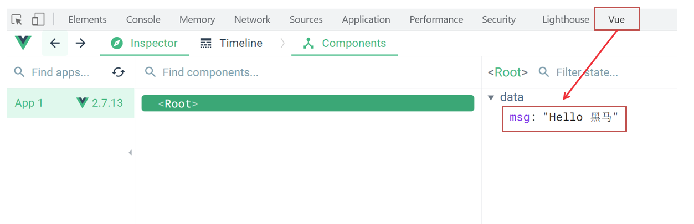

- [什么是 Vue](#什么是-vue)
  - [什么是构建用户界面](#什么是构建用户界面)
  - [什么是渐进式](#什么是渐进式)
  - [什么是框架](#什么是框架)
  - [Vue 的两种开发方式：](#vue-的两种开发方式)
- [创建 Vue 实例](#创建-vue-实例)
- [插值表达式 `{{}}`](#插值表达式-)
- [响应式特性](#响应式特性)
- [Vue 开发者工具安装](#vue-开发者工具安装)
- [Vue 中的常用指令](#vue-中的常用指令)
  - [内容渲染指令](#内容渲染指令)
  - [条件渲染指令](#条件渲染指令)
  - [事件绑定指令](#事件绑定指令)
  - [属性绑定指令](#属性绑定指令)
      - [v-bind:class](#v-bindclass)
      - [v-bind:style](#v-bindstyle)
  - [列表渲染指令](#列表渲染指令)
  - [双向绑定指令](#双向绑定指令)
- [指令修饰符](#指令修饰符)
  - [什么是指令修饰符？](#什么是指令修饰符)
  - [按键修饰符](#按键修饰符)
  - [v-model 修饰符](#v-model-修饰符)
  - [事件修饰符](#事件修饰符)
- [computed 计算属性](#computed-计算属性)
  - [语法](#语法)
  - [计算属性的优势](#计算属性的优势)
- [watch 侦听器](#watch-侦听器)
- [Vue 生命周期](#vue-生命周期)
  - [生命周期钩子](#生命周期钩子)
  - [`$nextTick`](#nexttick)

---

# 什么是 Vue

概念：Vue (读音 /vjuː/) 是一套 **构建用户界面** 的 **渐进式** **框架**

Vue2官网：<https://v2.cn.vuejs.org/>

## 什么是构建用户界面

**基于数据**渲染出用户可以看到的**界面**


## 什么是渐进式

所谓渐进式就是循序渐进，不一定非得把Vue中的所有API都学完才能开发Vue，可以学一点开发一点

## 什么是框架

所谓框架：就是一套完整的解决方案

**举个栗子**	

如果把一个完整的项目比喻为一个装修好的房子，那么框架就是一个毛坯房

我们只需要在“毛坯房”的基础上，增加功能代码即可

提到框架，不得不提一下库

- 库，类似工具箱，是一堆方法的集合，比如 axios、lodash、echarts等
- 框架，是一套完整的解决方案，实现了大部分功能，我们只需要按照一定的规则去编码即可。

下图是 库 和 框架的对比


框架的特点：有一套必须让开发者遵守的**规则**或者**约束**

咱们学框架就是学习的这些规则 [官网](https://v2.cn.vuejs.org/)

## Vue 的两种开发方式：

1. Vue 核心包开发
   - 场景：局部模块改造

2. Vue 核心包 & Vue 插件 & 工程化
   - 场景：整站开发


# 创建 Vue 实例

Vue 框架可以基于数据帮助我们渲染出用户界面

**核心步骤**

1. 准备容器
2. 引包（官网）：开发版本/生产版本
3. 创建 Vue 实例 `new Vue()`
4. 指定配置项，渲染数据
   1. `el` 指定挂载点
   2. `data` 提供数据

```html
<!-- Vue所管理的范围 -->
<div id="app">
  <!-- 这里将来会编写一些用于渲染的代码逻辑 -->
  <h1>{{ msg }}</h1>
</div>

<!-- 引入的是开发版本包 - 包含完整的注释和警告 -->
<script src="https://cdn.jsdelivr.net/npm/vue@2.7.14/dist/vue.js"></script>

<script>
  // 一旦引入 VueJS 核心包，在全局环境，就有了 Vue 构造函数
  const app = new Vue({
    // 通过 el 配置选择器，指定 Vue 管理的是哪个盒子
    el: '#app',
    // 通过 data 提供数据
    data: {
      msg: 'Hello 传智播客',
      count: 666
    },
    methods: {
    }
  })
</script>
```

# 插值表达式 `{{}}`

插值表达式语法：`{{ 表达式 }}`

```js
<p>{{nickName.toUpperCase()}}</p>

<p>{{age >= 18 ? '成年':'未成年'}}</p>

<p>{{obj.name}}</p>

<p>{{fn()}}</p>
```

1. 在插值表达式中使用的变量必须在 data 中进行了提供
2. 支持的是表达式，而非语句，比如：`if for`
3. 不能在标签属性中使用 `{{ }}` 插值 (插值表达式只能标签中间使用)

```js
<p title="{{username}}">我是P标签</p>  # worry!
```


# 响应式特性

​简单理解就是数据变，视图对应变

data 中的数据, 最终会被添加到 vue 实例上

1. 访问数据： "实例.属性名"
2. 修改数据： "实例.属性名"= "值"


# Vue 开发者工具安装

Vue Devtools

安装之后可以 F12 后看到多一个 Vue 的调试面板




# Vue 中的常用指令

vue 中的指令按照不同的用途可以分为如下 6 大类

-  内容渲染指令（v-html、v-text）
-  条件渲染指令（v-show、v-if、v-else、v-else-if）
-  事件绑定指令（v-on）
-  属性绑定指令 （v-bind）
-  双向绑定指令（v-model）
-  列表渲染指令（v-for）

指令是 vue 开发中最基础、最常用、最简单的知识点

## 内容渲染指令

内容渲染指令用来渲染 DOM 元素的文本内容

- v-text
  - 使用语法：`<p v-text="uname">hello</p>`，意思是将 uname 值渲染到 p 标签中
  - 类似 innerText，使用该语法，会覆盖 p 标签原有内容


- v-html
  - 使用语法：`<p v-html="intro">hello</p>`，意思是将 intro 值渲染到 p 标签中
  - 类似 innerHTML，使用该语法，会覆盖 p 标签原有内容
  - 类似 innerHTML，使用该语法，能够将 HTML 标签的样式呈现出来

代码演示：

```js
<div id="app">
    <h2>个人信息</h2>
    // 既然指令是vue提供的特殊的html属性，所以咱们写的时候就当成属性来用即可
    <p v-text="uname">姓名：</p>
    <p v-html="intro">简介：</p>
</div>

<script>
    const app = new Vue({
        el: '#app',
        data: {
            uname: '张三',
            intro: '<h2>这是一个<strong>非常优秀</strong>的boy<h2>'
        }
    })
</script>
```

## 条件渲染指令

条件判断指令，控制 DOM 的显示与隐藏

条件渲染指令有如下两个，分别是：

1. v-show

   1. 作用：  控制元素显示隐藏
   2. 语法：  `v-show="exp"` 表达式值为 true 显示， false 隐藏
   3. 原理：  添加 `style="display:none"` 达到隐藏效果
   4. 场景：  频繁切换显示隐藏的场景

2. v-if

   1. 作用：  控制元素显示隐藏（条件渲染）
   2. 语法：  `v-if="exp"` 表达式值为 true 显示， false 隐藏
   3. 原理：  基于条件 创建 或 移除 元素节点
   4. 场景：  要么显示，要么隐藏，不频繁切换的场景

3. v-else 和 v-else-if

   1. 作用：辅助 v-if 进行判断渲染
   2. 语法：`v-else` `v-else-if="表达式"`

示例代码：

```html
<p v-if="score >= 90">成绩评定A</p>
<p v-else-if="score >= 70">成绩评定B</p>
<p v-else-if="score >= 60">成绩评定C</p>
<p v-else>成绩评定D</p>
```

## 事件绑定指令

使用 Vue 时，如需为 DOM 注册事件，及其的简单，语法如下

注册事件 = 添加监听 + 处理逻辑

- `<button v-on:监听事件="处理逻辑"> </button>`
- `v-on:` 简写为 `@`

1. 内联语句

    ```html
    <div id="app">
        <button v-on:click="count++">+</button>
        <span>{{ count }}</span>
        <button @click="count--">-</button>
    </div>
    ```

2. 事件处理函数
   - methods 中的函数内部的 this 指向它属于的 Vue 实例
   - 如果不传递任何参数，则 methons 无需加小括号

    ```html
    # fn 是 vue 实例中的一个 methods

    <div id="app">
        <button v-on:click="fn">切换显示隐藏</button>
        <h1 v-show="isShow">黑马程序员</h1>
    </div>
    ```

## 属性绑定指令

1. 作用：动态设置 html 的标签属性，比如：src、url、title
2. 语法：`v-bind:属性名="exp"`
3. `v-bind:` 简写成 `:`

比如，有一个图片，它的 `src` 属性值数据 data 的 url 变量中存储

则可以这样设置属性值：

- `url` 为 vue 示例中的 data
- ``
- ``

#### v-bind:class

1. 对象语法

    ​适用场景：一个类名，来回切换

    ```html
    <div class="box" :class="{ 类名1: 布尔值, 类名2: 布尔值 }"></div>
    ```


2. 数组语法

    使用场景:批量添加或删除类

    ```html
    <div class="box" :class="[ 类名1, 类名2, 类名3 ]"></div>
    ```

#### v-bind:style

语法

```html
<div :style="{ CSS属性名1:属性值, CSS属性名2:属性值 }"></div>
```

## 列表渲染指令

基于一个数组来循环渲染一个列表结构

v-for 指令使用 `(item, index) in arr` 语法，其中：

- item 是数组中的每一项
- index 是每一项的索引，可以省略
- arr 是被遍历的数组

```html
// 遍历数组
<li v-for="(item,index) in somelist">{{ item }} - {{ index }} </li>

// 遍历对象
<div v-for="(value, key, index) in object">{{value}}</div>

// 遍历数字
// item 从 1 开始
<p v-for="item in 10">{{item}}</p>
```

## 双向绑定指令

所谓双向绑定就是：

1. 数据改变后，呈现的页面会更新
2. 页面更新后，数据也会随之而变

语法：`v-model="var"`

需求：使用双向绑定实现以下需求

1. 点击登录按钮获取表单中的内容
2. 点击重置按钮清空表单中的内容


```js
<div id="app">
    账户：<input type="text" v-model="usernameV"> <br><br>
    密码：<input type="password" v-model="passwordV"> <br><br>
    <button>登录</button>
    <button>重置</button>
</div>
```

- 下拉菜单  `select` value  // 在标签中设置属性 `value`
- 文本域    `texrarea` value
- 输入框    `input:text` value
- 单选框    `input:radio` value  // 在标签中设置属性 `value`
- 复选框    `input:checkbox` checked 

# 指令修饰符

## 什么是指令修饰符？

形如 `v-on:keyup.enter` 中 `enter` 就是修饰符

## 按键修饰符

`@keyup.enter` 点击 enter 键的时候才触发，等价于

```js
if ( e.key === "Enter" )
{
    do something
}
```

## v-model 修饰符

- `v-model.trim` 去除首位空格
- `v-model.number` 转数字

## 事件修饰符

- `@事件名.stop` 阻止冒泡
- `@事件名.prevent` 阻止默认行为
- `@事件名.stop.prevent` 阻止冒泡也阻止默认行为，连用

# computed 计算属性

基于现有的数据，计算出来的新属性

依赖的数据变化，自动重新计算

## 语法

```js
computed: {
    name (){
        logism
        return result
    }
}
```

```js
computed: {
    name: {
        get() {
            logism
            return result
        }
        set() {
            logism
        }
    }
}
```

- 使用起来和普通属性一样使用 `{{ name }}`
- computed 中的计算属性不能和 data 中的属性同名
- this 依然指向的是 Vue 实例

## 计算属性的优势

缓存特性（提升性能）

计算属性会对计算出来的结果缓存，再次使用直接读取缓存

依赖项变化了，会自动重新计算，并再次缓存


# watch 侦听器

​数据变化，则执行一些操作

语法

1. watch 同样声明在跟 data 同级的配置项中
2. 简单写法： 简单类型数据直接监视
3. 完整写法：添加额外配置项

```js
# data 中 words 变化，调用 watch 中的 words

data: {
    words: '苹果',
    obj: {
        son: '苹果'
    }
},

watch: {
    words (newValue, oldValue) {
        logism
    },
    'obj.son'(newValue, oldValue) {
        logism
    }
}
```

```js
# 完整写法
# 一次性 watch 多个变量

watch: {
    someOBJname: {
        deep: ture,       # 深度监视
        immediate: ture,  # 初始化时执行一次 handler()
        handler(newValue, oldValue) {
            logism
        }
    }
}
```

例子

```html
<script src="https://cdn.jsdelivr.net/npm/axios/dist/axios.min.js"></script>
<script>
  // 接口地址：https://applet-base-api-t.itheima.net/api/translate
  // 请求方式：get
  // 请求参数：
  // （1）words：需要被翻译的文本（必传）
  // （2）lang： 需要被翻译成的语言（可选）默认值-意大利
  // -----------------------------------------------

  const app = new Vue({
    el: '#app',
    data: {
      // words: ''
      obj: {
        words: ''
      },
      result: '', // 翻译结果
      // timer: null // 延时器id
    },

    watch: {
      'obj.words'(newValue) {

        clearTimeout(this.timer)

        this.timer = setTimeout(async () => {
          const res = await axios({
            url: 'https://applet-base-api-t.itheima.net/api/translate',
            params: {
              words: newValue
            }
          })
          this.result = res.data.data
          console.log(res.data.data)
        }, 300)
        
      }
    }
  })
</script>
```


# Vue 生命周期

思考：什么时候可以发送初始化渲染请求？（越早越好）什么时候可以开始操作dom？（至少dom得渲染出来）
 

生命周期四个阶段：

1. 创建阶段：创建响应式数据
2. 挂载阶段：渲染模板
3. 更新阶段：修改数据，更新视图
4. 销毁阶段：销毁 Vue 实例


## 生命周期钩子

Vue 生命周期过程中，会自动运行一些函数，被称为【生命周期钩子】

开发者可以在钩子中嵌入额外的逻辑


```js
// 与 data 平级

async created() {
  // 1. 发送请求获取数据
  const res = await axios.get('http://hmajax.itheima.net/api/news')
  // 2. 更新到 list 中，用于页面渲染 v-for
  this.list = res.data.data
}
```

```js
# mounted 获取焦点

// 核心思路：
// 1. 等 input 框渲染出来 mounted 钩子
// 2. 让 input 框获取焦点 inp.focus()
mounted() {
  document.querySelector('#inp').focus()
}
```

## `$nextTick`

等 DOM 更新后才会触发执行此方法里的函数体

```js
this.$nextTick(() => {
  // content
})
```

注意：`$nextTick` 内的函数体 一定是箭头函数，这样才能让函数内部的 this 指向 Vue 实例
