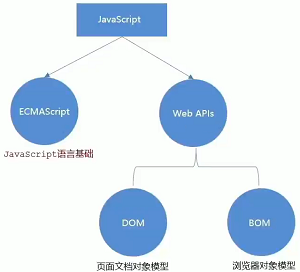
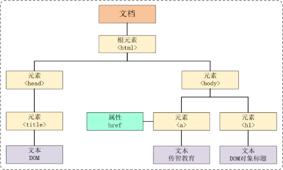

- [介绍](#介绍)
  - [组成](#组成)
  - [引入方式](#引入方式)
      - [内部](#内部)
      - [外部](#外部)
      - [内联](#内联)
  - [注释和结束符](#注释和结束符)
  - [输入和输出语法](#输入和输出语法)
      - [输出](#输出)
      - [输入](#输入)
- [变量](#变量)
  - [声明和赋值](#声明和赋值)
  - [变量名命名规则](#变量名命名规则)
- [常量](#常量)
- [数据类型](#数据类型)
  - [数值类型](#数值类型)
  - [字符串类型](#字符串类型)
      - [拼接](#拼接)
      - [模板字符串](#模板字符串)
  - [布尔类型](#布尔类型)
  - [undefined](#undefined)
  - [null](#null)
  - [检测数据类型](#检测数据类型)
- [类型转换](#类型转换)
  - [隐式转换](#隐式转换)
  - [显式转换](#显式转换)
      - [Number](#number)
      - [parseInt](#parseint)
      - [parseFloat](#parsefloat)
- [运算符](#运算符)
  - [算术运算符](#算术运算符)
  - [赋值运算符](#赋值运算符)
  - [自增/自减运算符](#自增自减运算符)
  - [比较运算符](#比较运算符)
  - [逻辑运算符](#逻辑运算符)
  - [运算符优先级](#运算符优先级)
- [语句](#语句)
  - [分支语句](#分支语句)
      - [if 分支语句](#if-分支语句)
      - [三元运算符](#三元运算符)
      - [switch语句（了解）](#switch语句了解)
      - [断点调试](#断点调试)
  - [循环语句](#循环语句)
- [数组](#数组)
  - [数组的基本使用](#数组的基本使用)
      - [定义数组和数组单元](#定义数组和数组单元)
      - [访问数组和数组索引](#访问数组和数组索引)
      - [数据单元值类型](#数据单元值类型)
      - [数组长度属性](#数组长度属性)
  - [操作数组](#操作数组)
- [函数](#函数)
  - [声明和调用](#声明和调用)
  - [匿名函数](#匿名函数)
      - [函数表达式](#函数表达式)
      - [立即执行函数](#立即执行函数)
- [对象](#对象)
  - [语法](#语法)
  - [属性和访问](#属性和访问)
  - [方法和调用](#方法和调用)
  - [null](#null-1)
  - [遍历对象](#遍历对象)
- [内置对象](#内置对象)
  - [Math](#math)
      - [属性](#属性)
      - [方法](#方法)
  - [JSON](#json)
  - [BOM](#bom)
      - [window](#window)
      - [loction](#loction)
  - [DOM](#dom)
      - [获取](#获取)
      - [修改](#修改)
  - [事件监听](#事件监听)

---

参考

- [W3school]()

# 介绍

## 组成



ECMAScript : 规定了 js 基础语法核心知识

权威网站：[MDN](https://developer.mozilla.org/zh-CN/docs/Web/JavaScript)

## 引入方式

跟 CSS 的引入差球不多

#### 内部

通过 `script` 标签包裹 JavaScript 代码

```html
<body>

    <!-- html 内容 -->

    <!-- 内联形式：通过 script 标签包裹 JavaScript 代码 -->
    <script>
        alert('hello,JS!')
    </script>

</body>
```

#### 外部

一般将 JavaScript 代码写在独立的以 `.js` 结尾的文件中，然后通过 `script` 标签的 `src` 属性引入

```javascript
// demo.js
document.write('嗨，欢迎来传智播学习前端技术！')
```

```html
<body>
    <!-- 外部形式：通过 script 的 src 属性引入独立的 .js 文件 -->
    <!-- script 标签之间就不写内容了，会被忽略 -->
    <script src="demo.js"></script>
</body>
```

#### 内联

```html
<body>
    <button onclick="alert('jj')">test</button>
</body>
```

##  注释和结束符

注释，跟 CSS 一样

在 JavaScript 中 `;` 代表一段代码的结束，多数情况下可以省略 `;`

```html
<script> 
    alert(1);
    alert(1)
</script>
```

实际开发中有许多人主张书写 JavaScript 代码时省略结束符 `;`

## 输入和输出语法

#### 输出

JavaScript 可以接收用户的输入，然后再将输入的结果输出：

`alert()`、`document.wirte()`、`console.log()`

####  输入

向 `prompt()` 输入任意内容会以弹窗形式出现在浏览器中，一般提示用户输入一些内容

```html
<script> 
    // 1. ouput
    document.write('要输出的内容')
    alert('要输出的内容');

    // 2. 以弹窗形式提示用户输入姓名
    prompt('请输入您的姓名:')
</script>
```

# 变量

```html
<script>
    x = 5
    y = 6

    // 将用户输入的内容保存在 num 这个变量中
    num = prompt('请输入一数字!')

    // 通过 num 变量将用户输入的内容输出出来
    alert(num)
</script>
```

## 声明和赋值

`let vname`

数组 `let arrayname = [1,2,3]`
数组长度 `arrayname.length`

`let` 和 `var` 都是 JavaScript 中的声明变量的关键字

推荐使用 `let` 声明变量！！！

```html
<script> 
    let age
    age = 18

    // 也可以声明和赋值同时进行
    let str = 'hello world!'
</script>
```

## 变量名命名规则

1. 只能是字母、数字、下划线、$，且不能数字开头
2. JavaScript 关键字不允许使用

# 常量

概念：使用 const 声明的变量称为 “常量”

使用场景：当某个变量永远不会改变的时候，就可以使用 const 来声明，而不是 let

命名规范：和变量一致

~~~javascript
const PI = 3.14
~~~

>注意： 常量不允许重新赋值，声明的时候必须初始化

# 数据类型

注：通过 `typeof` 关键字检测数据类型

```html
<script> 
    // 检测 1 是什么类型数据，结果为 number
    document.write(typeof 1)
</script>
```

## 数值类型

数字可以是整数、小数、正数、负数

```html
<script> 
    let score = 100 // 正整数
    let price = 12.345 // 小数
    let temperature = -40 // 负数
</script>
```

JavaScript 中的数值类型与数学中的数字是一样的，分为正数、负数、小数等

## 字符串类型

通过单引号（ `''`） 、双引号（ `""`）或反引号（ `` ` `` ）包裹的数据都叫字符串

单引号和双引号没有本质上的区别，推荐使用单引号


```html
<script>
    let gender = "男" // 使用双引号
    let str = '123' // 看上去是数字，但是用引号包裹了就成了字符串了
    let str1 = '' // 这种情况叫空字符串
</script>
```

#### 拼接

`+`

#### 模板字符串

使用场景：拼接字符串和变量

```js
let age = 18
document.write(`i am ${age}`)
```

## 布尔类型

它有两个固定的值 `true` 和 `false`

```html
<script>
    //  pink老师帅不帅？回答 是 或 否
    let isCool = true // 是的，摔死了！
    isCool = false // 不，套马杆的汉子！
</script>
```

## undefined

只声明变量，不赋值的情况下，变量的默认值为 undefined

一般很少【直接】为某个变量赋值为 undefined

```html
<script> 
    // 只声明了变量，并末赋值
    let tmp;
    document.write(typeof tmp) // 结果为 undefined
</script>
</body>
```

**注：JavaScript 中变量的值决定了变量的数据类型**

## null

赋值了，但是空值

## 检测数据类型

`typeof x`

`typeof(x)`

# 类型转换

## 隐式转换

任何数据和字符串相加为字符串

```html
<script> 
    let num = 13 // 数值
    let num2 = '2' // 字符串

    // 结果为 132
    // 原因是将数值 num 转换成了字符串，相当于 '13'
    console.log(num + num2)

    // 结果为 11
    // 原因是将字符串 num2 转换成了数值，相当于 2
    console.log(num - num2)

    alert(+ '1' + 1); //结果为 2
</script>
```

## 显式转换

#### Number

通过 `Number` 显示转换成数值类型

当转换失败时结果为 `NaN`（Not a Number）即不是一个数字

```html
<script>
    let t = '12'
    let f = 8

    // 显式将字符串 12 转换成数值 12
    t = Number(t)

    // 检测转换后的类型
    console.log(typeof t);
    console.log(t + f) // 结果为 20


    let str = 'hello'
    
    console.log(Number(str)) // 得到的结果为 NaN
</script>
```

#### parseInt

从字符串中提取整数

#### parseFloat

从字符串中提取小数


# 运算符

## 算术运算符

算术运算符：主要包括加、减、乘、除、取余等

## 赋值运算符

- `=`
- `+=`
- `-+`
- `*=`
- `/=`
- `%=`

## 自增/自减运算符

- 前置
- 后置

## 比较运算符

使用场景：比较两个数据大小、是否相等，根据比较结果返回一个布尔值（true / false）

除了常见的，下面还有：

- `===`：左右两边是否 `类型` 和 `值` 都相等（重点）
- `!==`：左右两边是否不全等

## 逻辑运算符

使用场景：可以把多个布尔值放到一起运算，最终返回一个布尔值

`&&`，`||`，`!`    

## 运算符优先级

# 语句

## 分支语句

分支语句包含：

1. if分支语句（重点）
2. 三元运算符
3. switch语句

#### if 分支语句

语法：

~~~javascript
if (条件表达式) {
    // 满足条件要执行的语句
}
~~~

~~~javascript
if (条件表达式) {
    // 满足条件要执行的语句
} else {
    // 不满足条件要执行的语句
}
~~~

~~~javascript
if (条件表达式) {
    // 执行的语句
} else if (条件表达式) {
    // 执行的语句
} else if (条件表达式) {
    // 执行的语句
} else {
    // 执行的语句
}
~~~

#### 三元运算符

语法：

~~~javascript
条件 ? 表达式1 ： 表达式2
~~~

#### switch语句（了解）

语法

~~~javascript
// switch分支语句

switch (表达式) {
  case 值1:
    代码1
    break

  case 值2:
    代码2
    break
  ...
  default:
    代码n
}
~~~

#### 断点调试

浏览器打开调试界面

1. 按 F12 打开开发者工具
2. 点到源代码一栏 ( sources )
3. 选择代码文件

## 循环语句

语法：

~~~javascript
while (条件表达式) {
    // 循环体    
}
~~~

~~~javascript
for (; ;) { }
~~~

`break`，`continue` 能来中止循环


# 数组

## 数组的基本使用

#### 定义数组和数组单元

```html
<script>
  // 1. 语法，使用 [] 来定义一个空数组
  // 定义一个空数组，然后赋值给变量 classes
  let classes = [];

  // 2. 定义非空数组
  let classes = ['小明', '小刚', '小红', '小丽', '小米']
</script>
```

#### 访问数组和数组索引

```html
<script>
    let classes = ['小明', '小刚', '小红', '小丽', '小米']
    
    classes[3] = '小小丽'
    document.write(classes[0]) // 结果为：小明
</script>
```

#### 数据单元值类型

数组做为数据的集合，它的单元值可以是任意数据类型

```html
<script>
  // 6. 数组单值类型可以是任意数据类型

  // a) 数组单元值的类型为字符类型
  let list = ['HTML', 'CSS', 'JavaScript']
  // b) 数组单元值的类型为数值类型
  let scores = [78, 84, 70, 62, 75]
  // c) 混合多种类型
  let mixin = [true, 1, false, 'hello']
</script>
```

#### 数组长度属性

重申一次，数组在 JavaScript 中并不是新的数据类型，它属于对象类型

```html
<script>
    console.log(array.length)
</script>
```

## 操作数组

数组做为对象数据类型，不但有 `length` 属性可以使用，还提供了许多方法：

1. `push` 动态向数组的尾部添加一个单元
2. `unshit` 动态向数组头部添加一个单元
3. `pop` 删除最后一个单元
4. `shift` 删除第一个单元
5. `splice` 动态删除任意单元


```html
<script>
  // 定义一个数组
  let arr = ['html', 'css', 'javascript']

  arr.push('Vue')
  arr.unshift('VS Code')
  arr.pop()
  arr.shift()
  arr.splice(2, 1) // 从索引值为2的位置开始删除1个单元
</script>
```


# 函数

## 声明和调用

```js
function sometest() {
    return;
}
```

```html
<script>
    // 定义求和函数
    function count(a, b) {
        let s = a + b
        return s
    }

    let total = count(5, 12)
</script>
```

## 匿名函数

#### 函数表达式

```js
let fn = function () {}
```

#### 立即执行函数

```js
(function () {})()
```


# 对象

对象数据类型可以被理解成是一种数据集合。它由属性和方法两部分构成

## 语法

声明一个对象类型的变量与之前声明一个数值或字符串类型的变量没有本质上的区别

```html
<script>
    // 声明对象类型变量，使用一对花括号
    // user 便是一个对象了，目前它是一个空对象
    let user = {}
    // 或者
    let user = new Object()
</script>
```

## 属性和访问

其本质是变量

1. 属性包括属性名和值，它们之间使用英文 `:` 分隔
2. 多个属性之间使用 `,` 分隔
3. 属性就是依附在对象上的变量
4. 属性名可以使用 `""` 或 `''`，一般情况下省略，除非名称遇到特殊符号

```js
let person = {
    name: '小明', // 描述人的姓名
    age: 18, // 描述人的年龄
    stature: 185, // 描述人的身高
    gender: '男', // 描述人的性别
}
```

属性访问：可以使用 `.` 或 `[]` 获得对象中属性对应的值

```js
// 访问人性别
console.log(person.gender) // 结果为 男
// 访问人的身高
console.log(person['stature']) // 结果为 185
```

属性扩展：动态为对象添加属性，动态添加与直接定义是一样的，只是语法上更灵活

```js
let user = {}
// 动态追加属性
user.name = '小明'
user['age'] = 18
// 删
delete user.name
```

## 方法和调用

其本质是函数

```js
let person = {
    name: '小红',
    age: 18,
    // 方法是由方法名和函数两部分构成，它们之间使用 : 分隔
    singing: function () {
        console.log('两只老虎，两只老虎，跑的快，跑的快...')
    },
    run: function () {
        console.log('我跑的非常快...')
    }
}
```

用法跟属性一模一样

注：无论是属性或是方法，同一个对象中出现名称一样的，后面的会覆盖前面的

## null

null 也是 JavaScript 中数据类型的一种，通常只用它来表示不存在的对象。使用 typeof 检测类型它的类型时，结果为 `object`

## 遍历对象

~~~javascript
let obj = {
    uname: 'pink'
}

for(let k in obj) {
    // k === 'uname'
    // obj[k] === obj['uname']
}
~~~

`for in` 不提倡遍历数组 因为 `k` 是字符串  

# 内置对象

回想一下我们曾经使用过的 `console.log`，`console` 其实就是 JavaScript 中内置的对象，该对象中存在一个方法叫 `log`，然后调用 `log` 这个方法，即 `console.log()`

除了 `console` 对象外，JavaScritp 还有其它的内置的对象

## Math

`Math` 是 JavaScript 中内置的对象，称为数学对象，这个对象下即包含了属性，也包含了许多的方法

#### 属性

- `Math.PI` 获取圆周率

#### 方法

- Math.random，生成 0 到 1 间的随机数

```javascript
// 0 ~ 1 之间的随机数, 包含 0 不包含 1
Math.random()
```

- Math.ceil，数字向上取整

```javascript
// 舍弃小数部分，整数部分加1
Math.ceil(3.4)
```

- Math.floor，数字向下取整

```javascript
// 舍弃小数部分，整数部分不变
Math.floor(4.68)
```

- Math.round，四舍五入取整

```javascript
// 取整，四舍五入原则
Math.round(5.46539)
Math.round(4.849)
```

- Math.max，在一组数中找出最大的

```javascript
// 找出最大值
Math.max(10, 21, 7, 24, 13)
```

- Math.min，在一组数中找出最小的

```javascript
// 找出最小值
Math.min(24, 18, 6, 19, 21)
```

- Math.pow，幂方法

```javascript
// 求某个数的多少次方
Math.pow(4, 2) // 求 4 的 2 次方
Math.pow(2, 3) // 求 2 的 3 次方
```

- Math.sqrt，平方根

```javascript
// 求某数的平方根
Math.sqrt(16)
```

## JSON

JSON 格式的字符串

- `var s = '{"key1": value1, "key2": value2}';`

字符串转为 JSON 对象

- `var j = JSON.parse(s);`

JSON 对象转为字符串

- `var s = JSON.stringify(j);`

## BOM

JavaScript 将浏览器的各个组成部分封装为对象
- `Window`：浏览器窗口对象
- `Navigator`：浏览器对象
- `Screen`：屏幕对象
- `History`：历史记录对象
- `Location`：地址栏对象

#### window

介绍：浏览器窗口对象，其中 `window.` 可以省略

属性
- history：对 History 对象的只读引用
- location：用于窗口或框架的 Location 对象
- navigator：对 Navigator 对象的只读引用

方法
- alert()：显示带有一段消息和一个确认按钮的警告框
- confirm()：显示带有一段消息以及确认按钮和取消按钮的对话框
- setInterval()：按照指定的周期（以毫秒计）来调用函数或计算表达式
- setTimeout()：在指定的毫秒数后调用函数或计算表达式

#### loction

介绍：地址栏对象，`window.location` 获取，其中 `window.` 可以省略

属性
- href：设置或返回完整的 URL

```js
alert(location.href);

location.href = "https://www.itcast.cn";
```

## DOM

将标记语言的各个组成部分封装为对应的对象

- `Document`：整个文档对象
- `Element`：元素对象
- `Attribute`：属性对象
- `Text`：文本对象
- `Comment`：注释对象

```html
<html>
    <head>
        <title>DOM</title>
    </head>
    <body>
        <h1>DOM对象标题</h1>
        <a href="https://itcast.cn">传智教育</a>
    </body>
</html>

```



#### 获取

HTML 中的 Element 对象可以通过 `Document` 对象获取，而 `Document` 对象是通过 `window` 对象获取的

Document 对象中提供了以下获取 Element 元素对象的函数

- 根据标签名称获取，返回 Element 对象数组
  - `var divs = document.getElementsByTagName('div');`
- 根据 id 属性值获取，返回单个 Element 对象
  - `var i = document.getElementById('i');`
- 根据 name 属性值获取，返回 Element 对象数组
  - `var ns = document.getElementsByName('n');`
- 根据 class 属性值获取，返回 Element 对象数组
  - `var clss = document.getElementsByClassName('cls');`

#### 修改

详细函数查手册

```js
var divs = document.getElementsByClassName('cls');
var div1 = divs[0];

div1.innerHTML = "XKY";
```

## 事件监听

① 通过 HTML 标签中的事件属性进行绑定

```html
<input type="button" onclick="on()" value="x">

<script>
    function on(){
        ...
    }
</script>
```

② 通过 DOM 元素属性绑定

```html
<input type="button" id="btn" value="x">

<script>
    document.getElementById('btn').onclick=function(){
        ...
    }
</script>
```

常见事件

- `onclick` : 鼠标单击事件
- `onblur` : 元素失去焦点
- `onfocus` : 元素获得焦点
- `onload` : 某个页面或图像被完成加载
- `onsubmit` : 当表单提交时触发该事件
- `onkeydown` : 某个键盘的键被按下
- `onmouseover` : 鼠标被移到某元素之上
- `onmouseout` : 鼠标从某元素移开
