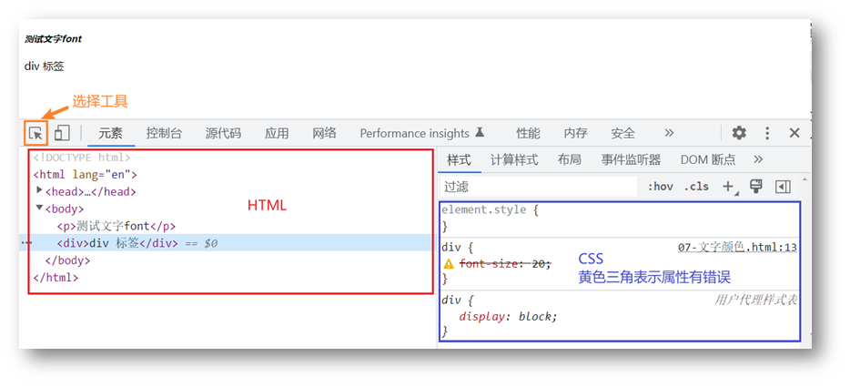

- [路径](#路径)
    - [相对路径](#相对路径)
    - [绝对路径](#绝对路径)
- [调试工具](#调试工具)
- [VScode 智能填充](#vscode-智能填充)
- [PxCook](#pxcook)
- [清除默认样式](#清除默认样式)
- [CSS精灵](#css精灵)


# 路径

### 相对路径

查找方式：从**当前文件位置**出发查找目标文件

特殊符号：

* **/** 表示进入某个文件夹里面 → `filedir/`
* **.** 表示当前文件所在文件夹 → `./`
* **..** 表示当前文件的上一级文件夹 → `../`   


### 绝对路径

```html

```

```html
<!-- 文件的在线网址作绝对路径 -->


```

> 提示
>
> Windows 默认是 \ ，其他系统是 /，建议统一写为 / 


# 调试工具

作用：检查、调试代码

1. 打开调试工具
   * 浏览器窗口内任意位置：鼠标右键 → 检查
   * 待检查的标签位置：鼠标右键 → 检查
   * F12
2. 使用调试工具
   * 


# VScode 智能填充

* HTML


* CSS：大多数简写方式为属性单词的**首字母** 


# PxCook

一款切图设计工具软件

支持 PSD 文件的文字、颜色、距离自动智能识别

* 开发面板（自动智能识别）
* 设计面板（手动测量尺寸和颜色）

# 清除默认样式 

清除标签默认的样式，比如：默认的内外边距


```css
/* 清除默认内外边距 */
* {
    margin: 0;
    padding: 0;
}

/* 清除列表的项目符号 */
li {
    list-style: none;
}

/* 链接没有下划线 */
a {
    text-decoration: none;
}
```

# CSS精灵

CSS Sprites

一张大图放在项目的本地 image 文件中

许多元素都会用到这张图的不同部分（ 利用 `background-position` 属性 ）

优点：减少服务器被请求次数，减轻服务器的压力，提高页面加载速度
