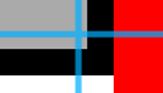

- [综合案例 - 注册信息](#综合案例---注册信息)
- [综合案例 - 热词](#综合案例---热词)
    - [HTML标签](#html标签)
    - [CSS样式](#css样式)
- [综合案例 - Banner](#综合案例---banner)
    - [HTML标签](#html标签-1)
    - [CSS样式](#css样式-1)
- [综合案例 - 新闻列表](#综合案例---新闻列表)
    - [整体布局](#整体布局)
    - [标题区域](#标题区域)
    - [内容区域](#内容区域)
- [综合案例之抖音解决方案](#综合案例之抖音解决方案)
    - [整体布局](#整体布局-1)
    - [列表布局](#列表布局)
    - [内容样式](#内容样式)


# 综合案例 - 注册信息


```html
<h1>注册信息</h1>
<form action="">
  <!-- 表单控件 -->
  <!-- 个人信息 -->
  <h2>个人信息</h2>
  <label>姓名：</label><input type="text" placeholder="请输入真实姓名">
  <br><br>
  <label>密码：</label><input type="password" placeholder="请输入密码">
  <br><br>
  <label>确认密码：</label><input type="password" placeholder="请输入确认密码">
  <br><br>
  <label>性别：</label>
  <label><input type="radio" name="gender"> 男</label>
  <label><input type="radio" name="gender" checked> 女</label>
  <br><br>
  <label>居住城市：</label>
  <select>
    <option>北京</option>
    <option>上海</option>
    <option>广州</option>
    <option>深圳</option>
    <option>武汉</option>
  </select>
  <!-- 教育经历 -->
  <h2>教育经历</h2>
  <label>最高学历：</label>
  <select>
    <option>博士</option>
    <option>硕士</option>
    <option>本科</option>
    <option>大专</option>
  </select>
  <br><br>
  <label>学校名称：</label><input type="text">
  <br><br>
  <label>所学专业：</label><input type="text">
  <br><br>
  <label>在校时间：</label>
  <select>
    <option>2015</option>
    <option>2016</option>
    <option>2017</option>
    <option>2018</option>
  </select>
  --
  <select>
    <option>2019</option>
    <option>2020</option>
    <option>2021</option>
    <option>2022</option>
  </select>
  <!-- 工作经历 -->
  <h2>工作经历</h2>
  <label>公司名称：</label><input type="text">
  <br><br>
  <label>工作描述：</label>
  <br>
  <textarea></textarea>
  <br><br>
  <!-- 协议 和 按钮 -->
  <input type="checkbox"><label>已阅读并同意以下协议：</label>
  <ul>
    <li><a href="#">《用户服务协议》</a></li>
    <li><a href="#">《隐私政策》</a></li>
  </ul>
  <br><br>
  <button>免费注册</button>
  <button type="reset">重新填写</button>
</form>
```

# 综合案例 - 热词


### HTML标签

```html
<a href="#">HTML</a>
<a href="#">CSS</a>
<a href="#">JavaScript</a>
<a href="#">Vue</a>
<a href="#">React</a>
```

### CSS样式

```html
<style>
    /* 默认效果 */
    a {
        display: block;

        width: 200px;
        height: 80px;
        background-color: #3064bb;
        
        color: #fff;
        text-decoration: none;
        text-align: center;
        line-height: 80px;
        font-size: 18px;
    }

    /* 鼠标悬停的效果 */
    a:hover {
        background-color: #608dd9;
    }
</style>
```

# 综合案例 - Banner


### HTML标签

```html
<div class="banner">
    <h2>让创造产生价值</h2>
    <p>我们希望小游戏平台可以提供无限的可能性，让每一个创作者都可以将他们的才华和创意传递给用户。</p>
    <a href="#">我要报名</a>
</div>
```

### CSS样式

```html
<style>
    .banner {
        height: 500px;
        background-color: #f3f3f4;
        background-image: url(./images/bk.png);
        background-repeat: no-repeat;
        background-position: left bottom;

        /* 文字控制属性，继承给子级 */
        text-align: right;
        color: #333;
    }

    .banner h2 {
        font-size: 36px;
        font-weight: 400;
        line-height: 100px;
    }

    .banner p {
        font-size: 20px;
    }

    .banner a {
        /* 转块级无法右对齐，因为块元素独占一行 */
        display: inline-block;

        width: 125px;
        height: 40px;
        background-color: #f06b1f;

        text-align: center;
        line-height: 40px;
        color: #fff;
        text-decoration: none;
        font-size: 20px;
    }
</style>
```

# 综合案例 - 新闻列表 


CSS 书写顺序：

1. 盒子模型属性
2. 文字样式
3. 圆角、阴影等修饰属性

### 整体布局

```html
<style>
    /* 清除默认样式 */
    * {
        margin: 0;
        padding: 0;
        box-sizing: border-box;
        background-color: red;
    }

    li {
        list-style: none;
    }

    a {
        text-decoration: none;
    }

    /* 整体 */
    .news {
        margin: 100px auto;
        width: 360px;
        height: 200px;
        background-color: yellow;
    }
</style>

<div class="news"></div>
```

### 标题区域

```html
<style>
    /* head */
    .news .hd {
        height: 34px;
        background-color: #aaa;

        border: 1px solid black;
        border-left: 0;
    }

    .news .hd a {
        /* -1 盒子向上移动，似乎没有任何意义，所以注释了 */
        /* margin-top: -1px; */

        display: block;
        width: 48px;
        /* 34 - 2 */
        height: 32px;

        border-top: 3px solid #ff8400;
        border-right: 1px solid #dbdee1;

        background-color: #fff;

        /* 29 = 32 - 3 */
        line-height: 29px;
        font-size: 14px;
        color: #333;
        text-align: center;
    }
</style>

<div class="hd">
    <a href="#">新闻</a>
</div>
```

`box-sizing: border-box;` 让黑线跟白线平行



### 内容区域

```html
<style>
    /* 内容 */
    .news .bd {
        padding: 5px;
        height: 166px;
        background-color: green;
    }

    .news .bd li {
        padding-left: 10px;
        background-color: #fff;
    }

    .news .bd li a {
        /* 为什么这里的 background-color 默认为 red？ */
        padding-left: 20px;
        
        color: #000;
        font-size: 12px;

        /* 因为 a 为行内元素，所以 a 的面积不变，li 的 高度变为了 25px */
        line-height: 25px;
    }

    .news .bd li a:hover {
        color: #ff8400;
    }
</style>

<div class="bd">
    <ul>
        <li><a href="#">点赞“新农人” 温暖的伸手</a></li>
        <li><a href="#">在希望的田野上...</a></li>
        <li><a href="#">“中国天眼”又有新发现 已在《自然》杂志发表</a></li>
        <li><a href="#">急！这个领域，缺人！月薪4万元还不好招！啥情况？</a></li>
        <li><a href="#">G9“带货”背后：亏损面持续扩大，竞争环境激烈</a></li>
        <li><a href="#">多地力推二手房“带押过户”，有什么好处？</a></li>
    </ul>
</div>
```

# 综合案例之抖音解决方案 


### 整体布局

```html
<style>
    * {
        margin: 0;
        padding: 0;
        box-sizing: border-box;
    }

    li {
        list-style: none;
    }

    .box {
        margin: 50px auto;
        width: 1200px;
        height: 420px;
        /* */
        border: 1px solid #000;
        border-radius: 10px;
        background-color: rebeccapurple;
    }
</style>

<div class="box"></div>
```

### 列表布局

```html
<style>
    .box ul {
        display: flex;

        /* 弹性盒子换行 */
        flex-wrap: wrap;

        /* 调整主轴对齐方式 调整行对齐方式 */
        justify-content: space-between;
        align-content: space-between;

        padding: 90px 40px 90px 60px;
        height: 418px;

        background-color: royalblue;
    }

    .box li {
        display: flex;
        width: 500px;
        height: 88px;
        background-color: pink;
    }
</style>

<div class="box">
    <ul>
        <li>1</li>
        <li>2</li>
        <li>3</li>
        <li>4</li>
    </ul>
</div>
```

### 内容样式

```html
<style>
    .box .pic {
        margin-right: 30px;
    }

    .box .text h4 {
        line-height: 40px;
        font-size: 20px;
        font-weight: 400;
        color: #333;
    }

    .box .text p {
        font-size: 14px;
        color: #666;
    }
</style>

<ul>
    <li>
        <div class="pic">
            
        </div>

        <div class="text">
            <h4>一键发布多端</h4>
            <p>发布视频到抖音短视频、西瓜视频及今日头条</p>
        </div>
    </li>

    <li>2</li>
    <li>3</li>
    <li>4</li>
</ul>
```